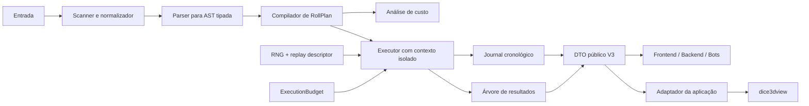

# Estudo de evolução do `@erpg/dicecore` para a V3

> Documento histórico de planejamento. Para o contrato implementado, consulte [API_V3.md](API_V3.md); para atualizar consumidores, consulte [MIGRATION_V3.md](MIGRATION_V3.md).

Data do estudo: **12 de julho de 2026**

## Resumo executivo

A V2 atual já é uma boa fachada ERPG sobre o motor herdado: tem API pública pequena, TypeScript estrito, ESM e CommonJS, normalização ergonômica, limites preventivos, seed, resultados estruturados e boa cobertura de testes. A V3 não deve ser apenas uma reorganização de pastas nem uma coleção de novas notações.

O objetivo recomendado para a V3 é transformar o pacote em um motor de resolução com contrato próprio, sem depender internamente do modelo de objetos legado para representar parser, execução e resultados.

A principal regra arquitetural proposta é:

> A fórmula é compilada uma vez para um plano tipado; o plano é executado com contexto isolado; o resultado é um DTO imutável, serializável e suficiente para todos os consumidores ERPG.

Os maiores ganhos esperados são:

- replay realmente estável e auditável, não apenas uma seed;
- RNG isolado por execução, sem mutação global;
- histórico cronológico de explosões, rerolls e descartes;
- grupos e subexpressões resolvidos e tipados para o frontend;
- uma única representação de fórmula para validação, custo, execução e UI;
- limites preventivos e também limites duros durante a execução;
- remoção gradual do núcleo legado não exportado;
- contrato de pacote, CI, documentação e migração no padrão adotado pelo `dice-box` V2.

## Estado atual validado

O checkout analisado já está em `@erpg/dicecore@2.0.0`. A release V2 aparece no commit `cf66aab`, seguida por correções de orçamento e pela remoção de `mathjs` do runtime.

### Qualidade atual

Validações executadas neste estudo:

| Verificação | Resultado |
|---|---:|
| Build + lint | passou |
| Suítes de teste | 39/39 |
| Testes | 1.001/1.001 |
| Cobertura de statements | 96,43% |
| Cobertura de branches | 90,43% |
| Vulnerabilidades de runtime | 0 |
| Tarball compactado | 84.927 bytes |
| Tarball descompactado | 481.724 bytes |
| Bundle ESM | 232.595 bytes |
| Bundle CJS | 232.970 bytes |

Benchmark local indicativo, sem pretensão de comparação entre máquinas:

| Caso | Operações/s |
|---|---:|
| normalização simples | 4.481.572 |
| inspeção simples em cache | 802.594 |
| verificação simples em cache | 1.436.204 |
| roll simples | 14.836 |
| roll múltiplo | 8.805 |
| pool de sucessos | 15.590 |

Esses números são uma baseline, não metas definitivas. O benchmark atual favorece operações em cache e precisa ganhar cenários cold/warm separados, fórmulas profundas e distribuições grandes.

### Uso real no ERPG

O pacote é consumido pelo frontend e pelo backend:

- o frontend usa ESM para rolagem, documentação interativa, recursos de ficha e integração 3D;
- o backend Nest consome o pacote em build CommonJS e usa inspeção/rolagem em regras de combate e VTT;
- o backend fixa um commit, enquanto o frontend acompanha a branch móvel do Git;
- o frontend precisa reconstruir grupos a partir de `roll.rolls[0].roll.rolls`, atualmente tipado como `unknown[]`, e usa outro avaliador matemático para chegar ao valor do grupo.

O último item é a evidência mais clara de uma lacuna do contrato V2: dados essenciais existem dentro do motor, mas não chegam ao consumidor em uma forma pública, estável e tipada.

## Diagnóstico arquitetural

### 1. A fachada concentra responsabilidades demais

`src/RpgDiceRoll.ts` possui aproximadamente 28 KB e reúne:

- parsing da entrada e multi-roll;
- extração de grupos por expressão regular;
- inspeção e cache;
- estimativa de custo;
- controle de limites;
- criação e troca de RNG;
- execução;
- travessia de resultados legados;
- projeção dos dados para UI/3D;
- cálculo de pool;
- criação de eventos;
- formatação textual.

O problema não é apenas tamanho. Essas responsabilidades evoluem por motivos diferentes e hoje compartilham detalhes internos frágeis.

### 2. Existem representações concorrentes da mesma fórmula

A fórmula é lida por caminhos diferentes:

- regex para grupos e contagem estática;
- parser Peggy para validação e custo;
- parser novamente para identificar grupos com target;
- `DiceRoll` novamente para executar;
- travessia heurística de objetos para produzir a resposta pública;
- reconstrução adicional no frontend para obter subexpressões.

Isso permite divergência de índice, grupo, custo e semântica. A V3 deve produzir uma AST/IR uma vez e reutilizá-la em todas as fases.

### 3. A seed não constitui replay estável

Na V2, fornecer `seed` troca temporariamente `generator.engine`, que é um singleton mutável. Mesmo que a API pública seja síncrona, esse desenho dificulta reentrância, testes isolados, workers, extensão futura e raciocínio sobre concorrência.

Além disso, a mesma seed só repete resultados enquanto algoritmo, ordem de consumo do RNG e semântica dos modificadores permanecerem idênticos. Uma atualização interna pode alterar a sequência sem mudar a entrada.

A V3 deve registrar algoritmo e versão de replay, além da seed, e injetar o RNG no contexto de uma execução.

### 4. Os eventos atuais são derivados do estado final

Os eventos públicos são reconstruídos depois da rolagem a partir de flags. Isso não preserva integralmente:

- valor descartado em um reroll e cada tentativa intermediária;
- relação pai/filho de um dado explodido;
- ordem real entre modificadores;
- transição antes/depois;
- motivo exato de exclusão do total;
- causalidade necessária para animações, auditoria e chat.

`sourceId` já existe no DTO, mas é sempre `null`. Isso indica que o contrato antecipa linhagem sem que o núcleo atual consiga fornecê-la.

### 5. O orçamento é estimado, não imposto no ponto de consumo

A inspeção calcula pior caso usando os objetos produzidos pelo parser. Modificadores de execução podem interagir, e uma soma de máximos não é necessariamente o pior caso real de uma composição.

A V3 deve manter a estimativa para feedback rápido, mas toda chamada ao RNG e toda criação de resultado dinâmico deve consumir um orçamento duro. O motor precisa encerrar deterministicamente ao atingir o limite, independentemente da precisão da estimativa.

### 6. O DTO público ainda vaza o núcleo legado

`RpgDiceRollSnapshot.rolls` é `unknown[]` e contém instâncias/estruturas internas. Isso:

- quebra a promessa de um resultado plenamente tipado;
- incentiva consumidores a depender de detalhes não documentados;
- dificulta persistência, transporte por API e evolução do motor;
- é a causa direta da reconstrução manual de grupos no frontend.

### 7. Build e distribuição ainda carregam herança do upstream

Foram observados:

- workflow de documentação chama `npm run docs:build`, script inexistente no `package.json` atual;
- workflow de deploy ainda aponta para o repositório de documentação do upstream;
- `rollup.config.js` conserva configuração residual de `mathjs`, já removido do runtime;
- o tarball inclui `tsconfig.json` sem necessidade para o consumidor;
- artefatos compilados são versionados e a geração em Windows muda dezenas de arquivos por fim de linha;
- a toolchain tem oito alertas de desenvolvimento e usa ESLint/Jest em gerações anteriores;
- não há `CHANGELOG`, documento de API V3, migração ou devlog equivalentes aos do `dice-box`.

## Invariantes propostas para a V3

Antes da implementação, recomenda-se aprovar estes invariantes:

1. Uma fórmula é parseada/compilada uma vez por plano.
2. A execução não altera estado global.
3. Com o mesmo plano, replay descriptor e versão de engine, o resultado é idêntico.
4. Todo resultado público é JSON-safe, tipado e não contém instâncias internas.
5. Todo dado gerado possui identidade e causalidade estáveis.
6. Nenhuma execução ultrapassa seus limites duros, mesmo se a estimativa estiver errada.
7. O core não formata UI, Discord, ANSI nem animação 3D.
8. O `dice3dview` nunca decide resultados; recebe apenas dados resolvidos.
9. Erros públicos possuem código, localização na fórmula e dados estruturados.
10. Compatibilidade é validada contra consumidores reais do frontend e backend.

## Arquitetura alvo



### Módulos sugeridos

```text
src/
├── api/
│   ├── createDiceEngine.ts
│   ├── inspect.ts
│   ├── roll.ts
│   └── types.ts
├── syntax/
│   ├── scanner.ts
│   ├── normalizer.ts
│   ├── parser.ts
│   ├── ast.ts
│   └── sourceSpan.ts
├── plan/
│   ├── compiler.ts
│   ├── rollPlan.ts
│   └── costAnalyzer.ts
├── execution/
│   ├── executor.ts
│   ├── executionContext.ts
│   ├── executionBudget.ts
│   ├── journal.ts
│   └── rng.ts
├── modifiers/
├── result/
│   ├── resultTree.ts
│   ├── publicResult.ts
│   └── poolSummary.ts
├── errors/
└── index.ts
```

Esses nomes são orientativos. A separação de responsabilidades é mais importante que a estrutura exata de diretórios.

## Contrato público recomendado

### Fachada funcional compatível

Manter nomes familiares reduz o custo de migração:

```ts
import {
  compileRpgDice,
  createDiceEngine,
  inspectRpgDiceNotation,
  rollRpgDice,
} from '@erpg/dicecore'

const plan = compileRpgDice('4d6kh3 + 2')
const result = rollRpgDice(plan, { seed: 'character-42' })
```

`rollRpgDice(string, options)` pode continuar como atalho que compila e executa. O plano compilado é útil para botões de ficha, automações e fórmulas repetidas.

### Instância configurável

```ts
const dice = createDiceEngine({
  limits: {
    maxInputLength: 2_000,
    maxAstDepth: 64,
    maxInitialDice: 10_000,
    maxGeneratedDice: 20_000,
    maxRandomCalls: 50_000,
  },
})

const inspection = dice.inspect('5d10>=8f=1')
const result = dice.roll(inspection.plan, { seed: 'encounter-42' })
```

A exportação funcional usa uma instância padrão imutável. Aplicações com políticas diferentes criam sua própria instância.

### Resultado V3

O estudo foi consolidado no contrato implementado em `docs/API_V3.md`. O resultado final mantém entidades somente na raiz e ranges por roll:

```ts
interface DiceRollResultV3 {
  readonly type: 'dice-roll'
  readonly schemaVersion: 3
  readonly input: string
  readonly notation: string
  readonly total: number
  readonly comment: string
  readonly replay: ReplayDescriptor
  readonly stats: ExecutionStats
  readonly dice: readonly ResolvedDie[]
  readonly groups: readonly ResolvedGroup[]
  readonly events: readonly DiceEvent[]
  readonly rolls: readonly ResolvedRoll[]
  readonly pool: PoolSummary | null
}
```

Cada dado deve distinguir valor bruto, valor final e contribuição:

```ts
interface ResolvedDie {
  readonly id: string
  readonly sourceNodeId: string
  readonly parentDieId: string | null
  readonly rollIndex: number
  readonly groupId: string
  readonly sides: number | 'F'
  readonly rawValue: number
  readonly value: number
  readonly contribution: number
  readonly included: boolean
  readonly states: readonly DiceState[]
}
```

Grupos e subexpressões devem ser públicos e estáveis:

```ts
interface ResolvedGroup {
  readonly id: string
  readonly sourceNodeId: string
  readonly kind: 'dice' | 'group' | 'function' | 'expression'
  readonly notation: string
  readonly span: { readonly start: number; readonly end: number }
  readonly value: number
  readonly childIds: readonly string[]
}
```

Isso permite que aliases avançados do ERPG apontem para `groupId`/`sourceNodeId`, sem regex de cardinalidade dinâmica nem reavaliação por `mathjs`.

### Journal de eventos

Eventos devem nascer durante a execução:

```ts
type DiceEvent =
  | { sequence: number; type: 'roll'; dieId: string; value: number }
  | { sequence: number; type: 'reroll'; dieId: string; from: number; to: number; reason: string }
  | { sequence: number; type: 'explode'; dieId: string; childDieId: string; reason: string }
  | { sequence: number; type: 'include'; dieId: string; contribution: number }
  | { sequence: number; type: 'exclude'; dieId: string; reason: string }
  | { sequence: number; type: 'classify'; dieId: string; outcome: 'success' | 'failure' | 'neutral' }
```

O journal completo serve a auditoria/replay. O array `dice` continua sendo a projeção conveniente do estado final.

### Erros

```ts
interface DiceErrorData {
  readonly code: DiceErrorCode
  readonly message: string
  readonly span: { start: number; end: number } | null
  readonly input: string
  readonly details: Readonly<Record<string, unknown>>
}
```

Além dos códigos V2, considerar:

- `INPUT_TOO_LONG`;
- `AST_TOO_DEEP`;
- `TOO_MANY_NODES`;
- `RANDOM_BUDGET_EXCEEDED`;
- `GENERATED_DICE_LIMIT_EXCEEDED`;
- `UNSUPPORTED_REPLAY_VERSION`;
- `NON_FINITE_RESULT`.

## Escopo funcional recomendado

### Obrigatório para a V3.0

- AST/IR tipada e compilação única;
- RNG por contexto, seed e replay versionado;
- orçamento duro de execução;
- DTO público JSON-safe sem `unknown[]`;
- grupos/subexpressões resolvidos;
- journal real com linhagem de explode/reroll;
- erros com source span;
- paridade documentada das notações V2;
- ESM + CommonJS + declarações TypeScript;
- migração dos consumidores front/back;
- documentação, changelog, devlog e guia V2 → V3;
- CI reproduzível em Linux e Windows.

### Recomendado para V3.x, sem bloquear V3.0

- cache explícito de planos compilados, configurável por instância;
- adaptador oficial `toDice3dDisplayRequest` em um pacote ou módulo de integração separado;
- estatísticas/distribuições analíticas para fórmulas sem executar RNG;
- streaming/callback de eventos para animação progressiva;
- cancelamento cooperativo para lotes muito grandes;
- serialização e validação de `RollPlan` para execução remota;
- API de funções matemáticas customizadas com whitelist.

### Fora do core

- formatação de cards, Discord, ANSI ou i18n;
- temas e skins;
- física e escolha de face 3D;
- regras de ficha específicas de um sistema;
- persistência de histórico de campanha;
- adaptação visual de lados não suportados pelo renderer.

## Compatibilidade e decisões de breaking change

### Preservar

- `rollRpgDice`, `inspectRpgDiceNotation`, `normalizeRpgDiceNotation` e `verifyRpgDiceNotation` como nomes de alto nível;
- aliases ERPG atuais, após transformar a tabela de compatibilidade em testes;
- suporte a browser, Node, ESM e CJS;
- `seed: string | number` como entrada conveniente;
- `total`, `dice`, `rolls`, `pool`, `notation`, `normalizedNotation` e `comment` onde a semântica continuar clara.

### Alterar na major

- remover `roll.rolls: unknown[]` e substituí-lo por `groups`/árvore tipada;
- trocar flags redundantes por estado tipado, mantendo helpers de migração se necessário;
- tornar o resultado readonly/imutável;
- definir semântica explícita de lote `N#formula` e do total agregado;
- versionar IDs, schema e replay;
- não expor classes, `Map`, `Set` ou objetos do parser no DTO;
- separar `maxInitialDice`, `maxGeneratedDice` e `maxRandomCalls` em vez de sobrecarregar `maxDice`.

### Não remover CJS na V3.0

O frontend atual é ESM, mas o backend Nest ainda pode carregar o caminho `require`. Remover CommonJS aumentaria o escopo de migração sem ganho relevante para o core, cujo bundle é pequeno. Essa decisão pode ser reavaliada quando o backend for ESM de ponta a ponta.

## Plano de implementação

### Fase 0 — congelar comportamento da V2

- criar corpus de notações reais do ERPG;
- adicionar golden tests de entrada, normalização, total, dados e erros;
- registrar explicitamente casos ambíguos e comportamento de multi-roll;
- salvar a baseline de bundle e benchmark;
- adicionar testes de integração no frontend e backend.

Saída: especificação executável da compatibilidade que deve ser preservada.

### Fase 1 — infraestrutura de pacote

- corrigir workflows herdados e `docs:build` inexistente;
- adicionar `.gitattributes` e geração determinística;
- escolher se artefatos continuarão versionados; se sim, criar gate `build && git diff --exit-code`;
- substituir `.npmignore` por `files` explícito no `package.json`;
- atualizar lint/test para versões suportadas;
- criar `CHANGELOG.md`, `docs/API.md`, `docs/MIGRATION_V3.md` e `DEVLOG_V3.md`;
- rodar matriz Node suportada + Linux/Windows.

### Fase 2 — AST e plano tipado

- fazer o Peggy produzir nós puros com source span;
- remover instanciação de classes nas ações da gramática;
- compilar AST para `RollPlan` imutável;
- usar o mesmo plano para grupos, targets, custo e execução;
- expor grupos e IDs estáveis.

### Fase 3 — executor isolado

- introduzir `ExecutionContext` com RNG e orçamento;
- portar dados e modificadores incrementalmente;
- consumir orçamento em cada RNG call e dado criado;
- emitir journal durante as transições;
- manter testes diferenciais V2 × V3 onde a semântica é preservada.

### Fase 4 — novo DTO e integrações

- gerar resultado JSON-safe e readonly;
- eliminar snapshot legado;
- migrar `advancedRollRuntime` para `groups` públicos;
- remover reconstrução de subexpressões com `mathjs` no frontend;
- migrar o adaptador do `dice3dview` usando `parentDieId`, `included` e lados;
- validar usos de inspeção no backend.

### Fase 5 — hardening e release

- property-based/fuzz tests do parser e normalizador;
- testes de orçamento contra fórmulas hostis;
- teste de replay entre browser e Node;
- teste de serialização round-trip;
- budget de bundle e benchmark com limiar de regressão;
- release candidate consumida por front/back;
- publicar tag imutável e fixar ambos os consumidores nela.

## Estratégia de testes V3

Além da cobertura atual, a V3 precisa testar propriedades do contrato:

- `normalize(normalize(x)) === normalize(x)`;
- compilar e inspecionar nunca consome RNG;
- o mesmo replay descriptor produz o mesmo resultado em Node e browser;
- nenhum resultado contém `Map`, `Set`, função, símbolo ou instância interna;
- todo `parentDieId` aponta para um dado existente;
- `sequence` de eventos é estritamente crescente;
- a soma das contribuições coincide com o total da expressão correspondente;
- o orçamento observado nunca ultrapassa o limite configurado;
- parse/print/parse preserva a semântica do plano;
- entradas aleatórias nunca travam nem escapam dos limites.

Recomenda-se manter cobertura alta, mas usar gates adicionais:

- 100% dos códigos de erro públicos cobertos;
- 100% das variantes de evento cobertas;
- corpus de compatibilidade V2;
- fuzz com seed reproduzível;
- pacote instalado e importado em projetos-fixture ESM e CJS;
- `npm pack` inspecionado automaticamente.

## Metas mensuráveis sugeridas

| Área | Meta V3 |
|---|---|
| Compatibilidade | 100% do corpus V2 aprovado ou diferença documentada |
| Tipagem pública | zero `any` e zero `unknown[]` em resultados públicos |
| Estado global de execução | zero |
| Serialização | todo resultado passa por JSON round-trip |
| Replay | igualdade Node/browser para algoritmo e versão fixados |
| Segurança | limite duro testado para RNG, dados gerados, nós e profundidade |
| Cobertura | ≥ 95% statements e ≥ 90% branches |
| Distribuição | sem crescimento desnecessário; budget inicial ≤ 600 KB unpacked |
| CI | Linux + Windows, ESM + CJS, pacote instalado de tarball |
| Documentação | API, migração, changelog, devlog e exemplos executáveis |

O budget de 600 KB é conservador em relação aos atuais 481.724 bytes e permite metadados novos sem aceitar crescimento descontrolado.

## Riscos e mitigação

| Risco | Impacto | Mitigação |
|---|---|---|
| Reescrita muda semântica sutil | alto | golden tests e execução diferencial |
| Replay quebra após otimização | alto | algoritmo e versão explícitos |
| Journal aumenta memória | médio | projeção configurável e eventos compactos |
| AST pública engessa parser | médio | expor `RollPlan` estável, manter AST detalhada interna |
| IDs mudam aliases salvos | alto | IDs derivados do plano/versionados e migração |
| Duplo motor durante transição | médio | portar verticalmente por tipo/modificador e remover legado por fase |
| Front e back em commits diferentes | alto | RC tagueada e matriz de integração |
| Escopo cresce com regras de sistemas | alto | manter regras específicas fora do core |

## Ordem de prioridade

### P0 — fundação da V3

1. Corpus de compatibilidade e contratos.
2. AST/`RollPlan` único e tipado.
3. RNG contextual + replay versionado.
4. Orçamento duro de execução.
5. Resultado JSON-safe com grupos e journal reais.

### P1 — integração e confiabilidade

1. Migração do frontend sem acesso a `unknown[]`.
2. Migração do backend e pin em release imutável.
3. CI, pacote e geração reproduzíveis.
4. Documentação no padrão do `dice-box`.
5. Fuzz, fixtures ESM/CJS e budgets automatizados.

### P2 — evolução pós-3.0

1. Planos serializáveis/remotos.
2. Eventos progressivos/cancelamento.
3. Estatística analítica.
4. Extensões matemáticas controladas.
5. Adaptadores oficiais separados.

## Critério de conclusão da V3.0

A V3.0 estará pronta quando:

- front e back funcionarem sobre uma release candidate tagueada;
- nenhuma integração depender do snapshot legado;
- todas as notações suportadas estiverem documentadas e no corpus;
- replay for reproduzível entre runtimes para a versão publicada;
- limites duros forem demonstrados por testes hostis;
- resultado e erros forem completamente serializáveis;
- build e artefatos forem reproduzíveis em Linux e Windows;
- API, migração, changelog e devlog estiverem publicados;
- diferenças intencionais da V2 estiverem listadas no guia de migração.

## Recomendação final

Recomenda-se avançar com a V3 como **reescrita interna incremental com contrato novo**, e não como reescrita total em um único corte.

O primeiro marco não deve adicionar sintaxe. Deve criar `RollPlan`, `ExecutionContext`, orçamento duro e journal, mantendo o corpus V2 verde. Depois disso, grupos tipados e causalidade dos dados resolvem imediatamente problemas reais do frontend. Só então vale expandir notações ou recursos.

Esse caminho repete a melhor decisão tomada no `dice-box` V2: começar por invariantes e fronteiras de responsabilidade, medir a baseline, migrar consumidores reais e documentar as quebras como parte do produto.
