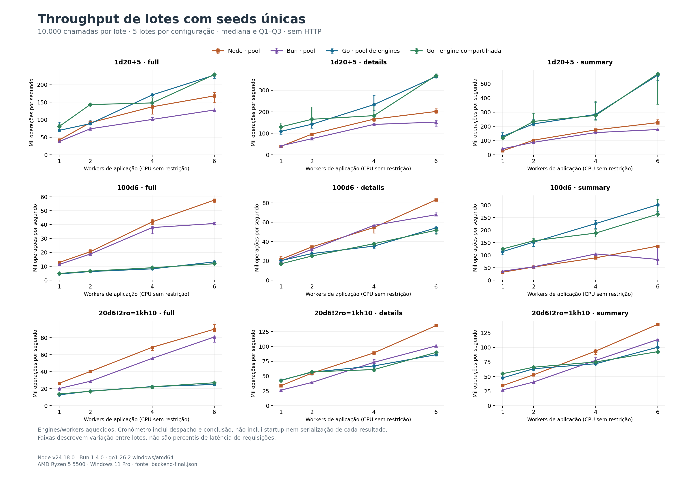
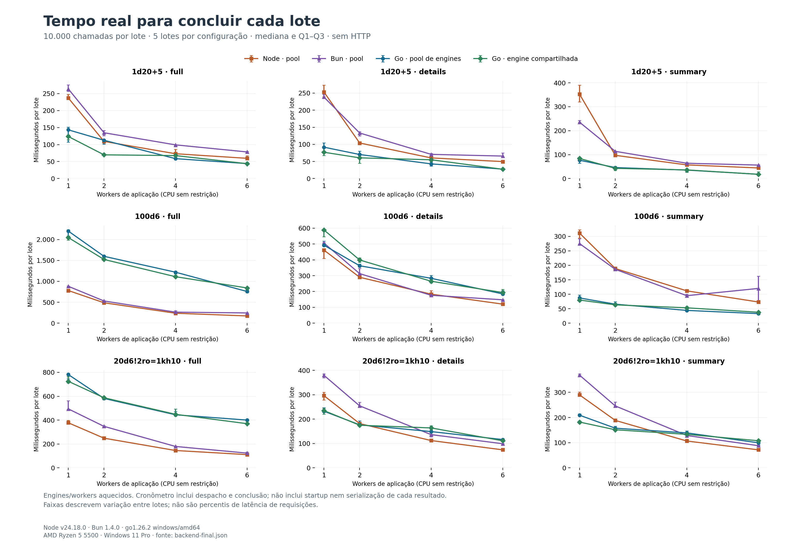
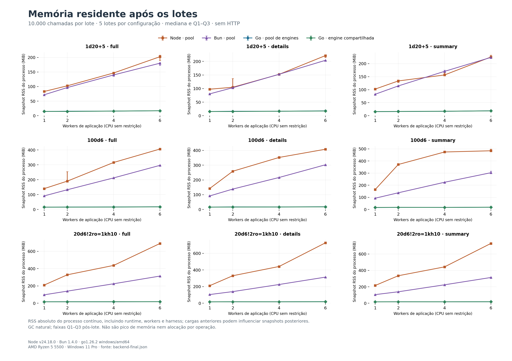

# Lotes e concorrência: Go, Node e Bun

Medição de chamadas locais da biblioteca com seeds únicas, sem HTTP, sockets ou Discord. Cada lote conclui 10.000 rolagens; todos os runtimes recebem as mesmas expressões, modos, índices e seeds. Este experimento complementa as [17 cargas históricas](BENCHMARK.md), que continuam publicadas integralmente. Não havia medição concorrente ou Bun no [baseline original](benchmarks/baseline/README.md).

## Ambiente

AMD Ryzen 5 5500 · Windows 11 Pro · x64 · 12 CPUs lógicas. Node v24.18.0; Bun 1.4.0; go version go1.26.2 windows/amd64. Commit-base `62de50293b2e22121f8ae3832f303da973e24934`, com 34 entradas alteradas/não rastreadas. Manifesto estável: `c175afa3b958880f7e576a5152a3deadd3f94368e90f1d4d0c7ff62cab85c77c`. Execução concluída em 2026-09-14T01:27:15.699Z, com 250,54 s de duração total.

## Método e equivalência

São 5 lotes por carga/configuração, com 1/2/4/6 workers. Cada configuração mantém o processo, as engines e os workers durante os lotes; cada carga aquece 5.000 chamadas por worker uma vez antes dos lotes. Processos, imports, criação de engines, seeds e aquecimento ficam fora do cronômetro. A ordem dos runtimes alterna entre configurações de workers; runtimes distintos não medem simultaneamente.

O timer mede o tempo real do início da liberação/envio do lote até a confirmação de conclusão de todos os workers. Inclui despacho e retorno dos contadores agregados. Cada chamada constrói o resultado do modo escolhido; serialização JSON e transferência de cada resultado completo para outro processo não são medidas. Node/Bun usam worker_threads com uma engine por isolate. Go usa goroutines e preserva o GOMAXPROCS padrão/configurado, registrado nos dados brutos; `go-pool` usa uma engine por worker e `go-shared` compartilha uma engine, incluindo eventual contenção do cache. Não há restrição de afinidade ou quota de CPU em nenhum runtime.

MT19937, limites padrão, cache aquecido e freezeResults='never' em todos. A seed de índice i é `dicecore-backend/v3.7.1/` + i; são 10.000 seeds distintas por lote. O conjunto é repetido nos lotes para comparabilidade. Warmup não é contado como trabalho entregue. Os índices são divididos em passos do número de workers, sem perder ou duplicar chamadas.

O preflight comparou JSON completo de 108 resultados por configuração e passou nos quatro modos de runtime e em todos os números de workers. Cada lote medido também confirmou contagem, soma dos totais, soma ponderada pelo índice e chamadas aleatórias, iguais entre runtimes e configurações. Esses contadores detectam divergências de entrega, mas não substituem a suíte de conformidade nem constituem hash criptográfico dos resultados.

## Resultados

Cada célula mostra **operações/s / mediana do lote em ms [Q1–Q3]**. Maior throughput e menor duração indicam melhor desempenho. Os quartis são entre lotes; não representam p95 de requisições individuais. Tempo amortizado por chamada está no JSON, sem interpretá-lo como latência de uma chamada concorrente.

| Carga | Workers | Node | Bun | Go pool | Go compartilhada |
|---|---:|---:|---:|---:|---:|
| 1d20+5 · full | 1 | 42.161 / 237,19 [233,34–247,32] | 37.893 / 263,90 [256,72–276,10] | 69.763 / 143,34 [107,44–151,31] | 80.801 / 123,76 [114,01–128,84] |
| 1d20+5 · full | 2 | 91.491 / 109,30 [103,87–112,06] | 74.216 / 134,74 [125,87–141,66] | 88.805 / 112,61 [100,96–113,91] | 143.415 / 69,73 [68,44–70,71] |
| 1d20+5 · full | 4 | 137.059 / 72,96 [72,52–85,78] | 100.935 / 99,07 [93,90–99,13] | 170.983 / 58,49 [57,54–59,23] | 148.130 / 67,51 [61,32–70,96] |
| 1d20+5 · full | 6 | 168.201 / 59,45 [56,04–67,16] | 127.822 / 78,23 [76,45–80,10] | 227.387 / 43,98 [43,88–45,75] | 228.820 / 43,70 [43,07–43,85] |
| 1d20+5 · details | 1 | 39.493 / 253,21 [239,20–273,71] | 41.955 / 238,35 [236,33–245,99] | 109.012 / 91,73 [75,72–104,48] | 130.036 / 76,90 [67,71–91,69] |
| 1d20+5 · details | 2 | 96.210 / 103,94 [98,84–104,87] | 75.064 / 133,22 [124,94–136,46] | 142.291 / 70,28 [62,12–80,57] | 165.258 / 60,51 [44,88–68,04] |
| 1d20+5 · details | 4 | 165.936 / 60,26 [59,62–63,96] | 141.442 / 70,70 [68,28–73,67] | 233.519 / 42,82 [36,09–48,22] | 182.209 / 54,88 [42,42–59,29] |
| 1d20+5 · details | 6 | 201.519 / 49,62 [46,56–51,59] | 152.126 / 65,74 [62,79–74,98] | 363.757 / 27,49 [26,51–27,66] | 368.643 / 27,13 [26,85–27,46] |
| 1d20+5 · summary | 1 | 28.380 / 352,36 [320,20–390,01] | 42.496 / 235,32 [234,83–243,26] | 130.767 / 76,47 [63,79–77,16] | 119.229 / 83,87 [80,10–87,68] |
| 1d20+5 · summary | 2 | 103.174 / 96,92 [95,78–97,99] | 88.065 / 113,55 [112,32–114,22] | 217.954 / 45,88 [40,39–48,00] | 235.365 / 42,49 [34,07–47,35] |
| 1d20+5 · summary | 4 | 175.543 / 56,97 [56,84–64,36] | 156.612 / 63,85 [62,76–67,34] | 284.231 / 35,18 [27,24–39,87] | 277.456 / 36,04 [26,38–40,85] |
| 1d20+5 · summary | 6 | 226.411 / 44,17 [40,47–46,41] | 177.959 / 56,19 [55,40–57,67] | 561.044 / 17,82 [17,56–19,12] | 569.755 / 17,55 [17,55–28,10] |
| 100d6 · full | 1 | 12.817 / 780,20 [743,98–794,23] | 11.341 / 881,75 [843,18–890,19] | 4.545 / 2.200,39 [2.084,07–2.231,49] | 4.887 / 2.046,14 [1.984,91–2.063,94] |
| 100d6 · full | 2 | 20.492 / 487,99 [451,68–494,65] | 18.847 / 530,59 [529,65–537,32] | 6.261 / 1.597,16 [1.543,64–1.620,96] | 6.569 / 1.522,22 [1.520,39–1.532,46] |
| 100d6 · full | 4 | 41.986 / 238,17 [227,52–249,31] | 37.876 / 264,02 [259,25–298,16] | 8.209 / 1.218,11 [1.181,16–1.230,58] | 9.006 / 1.110,40 [1.090,50–1.148,88] |
| 100d6 · full | 6 | 57.587 / 173,65 [171,70–179,35] | 40.779 / 245,22 [240,20–249,50] | 13.201 / 757,50 [726,68–803,41] | 11.877 / 842,00 [797,35–860,70] |
| 100d6 · details | 1 | 21.664 / 461,60 [408,41–471,26] | 19.764 / 505,98 [505,91–508,28] | 20.308 / 492,42 [488,96–518,50] | 16.986 / 588,73 [545,06–593,31] |
| 100d6 · details | 2 | 34.504 / 289,83 [286,41–291,46] | 31.960 / 312,89 [312,55–345,09] | 27.578 / 362,61 [361,76–373,67] | 25.066 / 398,95 [385,13–411,79] |
| 100d6 · details | 4 | 54.539 / 183,35 [177,13–204,85] | 56.758 / 176,19 [175,57–177,01] | 35.289 / 283,37 [278,39–301,75] | 37.765 / 264,80 [255,25–289,43] |
| 100d6 · details | 6 | 83.045 / 120,42 [118,75–122,09] | 67.666 / 147,78 [141,74–148,78] | 54.084 / 184,90 [183,43–206,19] | 51.644 / 193,64 [183,12–213,13] |
| 100d6 · summary | 1 | 32.114 / 311,39 [294,70–323,31] | 36.350 / 275,10 [273,66–292,16] | 114.531 / 87,31 [86,75–97,64] | 124.887 / 80,07 [79,83–81,17] |
| 100d6 · summary | 2 | 52.930 / 188,93 [185,15–193,47] | 53.711 / 186,18 [184,70–187,94] | 152.108 / 65,74 [63,70–73,94] | 157.595 / 63,45 [59,38–64,89] |
| 100d6 · summary | 4 | 89.463 / 111,78 [111,02–112,25] | 105.100 / 95,15 [94,39–100,22] | 226.159 / 44,22 [41,70–48,52] | 188.157 / 53,15 [49,47–57,75] |
| 100d6 · summary | 6 | 136.363 / 73,33 [72,17–73,58] | 83.217 / 120,17 [75,31–162,80] | 301.201 / 33,20 [33,20–36,38] | 263.868 / 37,90 [30,90–39,56] |
| 20d6!2ro=1kh10 · full | 1 | 26.469 / 377,81 [371,53–397,12] | 20.241 / 494,05 [490,29–563,11] | 12.790 / 781,84 [745,35–784,51] | 13.796 / 724,86 [711,67–763,08] |
| 20d6!2ro=1kh10 · full | 2 | 40.222 / 248,62 [247,41–250,09] | 28.769 / 347,60 [343,15–353,77] | 17.200 / 581,41 [571,13–590,56] | 17.032 / 587,14 [584,32–596,71] |
| 20d6!2ro=1kh10 · full | 4 | 68.734 / 145,49 [143,14–153,89] | 55.746 / 179,38 [178,61–182,00] | 22.496 / 444,52 [438,04–471,63] | 22.294 / 448,56 [445,44–492,08] |
| 20d6!2ro=1kh10 · full | 6 | 89.998 / 111,11 [104,63–114,50] | 80.836 / 123,71 [122,11–133,62] | 24.980 / 400,33 [391,47–404,79] | 27.028 / 369,99 [364,47–376,26] |
| 20d6!2ro=1kh10 · details | 1 | 33.733 / 296,45 [279,27–310,58] | 26.317 / 379,98 [369,88–385,54] | 42.987 / 232,63 [228,97–247,00] | 42.516 / 235,21 [220,52–245,04] |
| 20d6!2ro=1kh10 · details | 2 | 55.039 / 181,69 [180,07–187,41] | 39.294 / 254,49 [253,99–269,50] | 56.615 / 176,63 [172,33–192,50] | 57.132 / 175,03 [175,02–175,45] |
| 20d6!2ro=1kh10 · details | 4 | 89.174 / 112,14 [110,08–114,91] | 73.279 / 136,46 [127,73–137,66] | 67.139 / 148,94 [146,70–153,61] | 60.988 / 163,97 [156,61–173,29] |
| 20d6!2ro=1kh10 · details | 6 | 135.074 / 74,03 [72,74–74,53] | 100.885 / 99,12 [95,86–99,78] | 86.020 / 116,25 [108,98–117,25] | 89.908 / 111,23 [108,99–118,99] |
| 20d6!2ro=1kh10 · summary | 1 | 34.526 / 289,64 [287,45–301,02] | 27.170 / 368,06 [367,98–373,01] | 47.813 / 209,15 [208,91–214,07] | 54.962 / 181,94 [176,62–186,56] |
| 20d6!2ro=1kh10 · summary | 2 | 53.071 / 188,43 [188,23–190,87] | 40.665 / 245,91 [244,61–260,96] | 63.491 / 157,50 [156,56–165,20] | 66.116 / 151,25 [148,66–153,85] |
| 20d6!2ro=1kh10 · summary | 4 | 93.718 / 106,70 [102,39–113,67] | 77.804 / 128,53 [121,19–128,75] | 72.018 / 138,85 [138,18–146,39] | 75.090 / 133,17 [131,88–134,11] |
| 20d6!2ro=1kh10 · summary | 6 | 139.624 / 71,62 [71,52–72,01] | 113.494 / 88,11 [87,43–89,39] | 100.329 / 99,67 [91,08–100,41] | 92.778 / 107,78 [102,01–108,27] |

## Leitura com seis workers

Com a configuração padrão de GC, Go teve maior throughput que Node e Bun em quatro das nove cargas de seis workers: os três modos de `1d20+5` e `100d6` summary. Em `1d20+5` summary, a engine compartilhada entregou 569.755 operações/s, contra 226.411 no Node e 177.959 no Bun. Em `100d6` summary, foram 263.868, 136.363 e 83.217 operações/s, respectivamente.

As cinco cargas restantes favoreceram Node/Bun. `100d6` full foi a maior limitação: 11.877 operações/s em Go compartilhado, contra 57.587 no Node e 40.779 no Bun. O lote de 10.000 chamadas levou 842,00 ms em Go, 173,65 ms no Node e 245,22 ms no Bun. No pool com modificadores, Go também ficou atrás nos três modos. Esses resultados impedem afirmar um ganho geral de throughput apenas pela mudança de linguagem.

| Carga | Node ops/s | Bun ops/s | Go pool ops/s | Go compartilhada ops/s |
|---|---:|---:|---:|---:|
| 1d20+5 full | 168.201 | 127.822 | 227.387 | 228.820 |
| 1d20+5 details | 201.519 | 152.126 | 363.757 | 368.643 |
| 1d20+5 summary | 226.411 | 177.959 | 561.044 | 569.755 |
| 100d6 full | 57.587 | 40.779 | 13.201 | 11.877 |
| 100d6 details | 83.045 | 67.666 | 54.084 | 51.644 |
| 100d6 summary | 136.363 | 83.217 | 301.201 | 263.868 |
| Pool full | 89.998 | 80.836 | 24.980 | 27.028 |
| Pool details | 135.074 | 100.885 | 86.020 | 89.908 |
| Pool summary | 139.624 | 113.494 | 100.329 | 92.778 |

Separar engines não garantiu uma melhoria uniforme frente à engine compartilhada. A diferença dependeu da carga, e os quartis da tabela completa devem acompanhar essa comparação. Aumentar workers também não produziu ganho linear em todos os casos.

## Gráficos de throughput e duração





[Throughput SVG](benchmarks/backend-throughput.svg) · [Duração SVG](benchmarks/backend-batches.svg).

## Memória residente do processo

Snapshots RSS, em MiB: **após aquecimento / mediana após lotes / maior snapshot após lotes**. Node/Bun usam process.memoryUsage().rss; Go Windows usa GetProcessMemoryInfo.WorkingSetSize (Linux: /proc/self/statm). Incluem runtime, workers, caches e estruturas compactas de seeds/options pré-criadas pelo harness. São valores absolutos, sem subtrair o snapshot inicial. As leituras acontecem fora do timer, com GC natural. O maior snapshot observado não é o pico real do processo; transientes entre leituras e pico de startup não foram amostrados. Não se comparam heaps JS/Go nem B/op entre linguagens.

Com seis workers, as medianas de RSS ficaram aproximadamente entre 17 e 19 MiB em Go, 202 e 728 MiB no Node e 180 e 314 MiB no Bun, conforme a carga e o momento da leitura. Para `1d20+5` summary, especificamente, foram 18,52 MiB em Go compartilhado, 225,52 MiB no Node e 223,96 MiB no Bun. Essa redução de memória residente não eliminou as perdas de throughput nos modos full.

Cada configuração mantém um processo durante toda a sequência de cargas. Por isso, snapshots de cargas posteriores também podem refletir memória reservada ou retida após cargas anteriores. A comparação descreve o processo contínuo deste experimento; não representa a memória isolada necessária para executar apenas uma expressão nem uma estimativa de RAM do servidor completo.

| Carga | Workers | Node | Bun | Go pool | Go compartilhada |
|---|---:|---:|---:|---:|---:|
| 1d20+5 · full | 1 | 79,89 / 83,16 / 85,68 | 61,46 / 71,84 / 74,23 | 14,77 / 14,44 / 15,59 | 14,55 / 14,80 / 15,26 |
| 1d20+5 · full | 2 | 101,01 / 102,59 / 102,88 | 84,27 / 96,64 / 97,91 | 14,16 / 15,35 / 22,94 | 14,89 / 14,63 / 16,05 |
| 1d20+5 · full | 4 | 144,06 / 146,63 / 154,63 | 124,83 / 139,86 / 149,86 | 16,63 / 15,81 / 16,79 | 14,82 / 15,91 / 16,18 |
| 1d20+5 · full | 6 | 188,35 / 202,34 / 219,96 | 167,23 / 180,12 / 190,84 | 15,48 / 16,95 / 17,59 | 15,35 / 17,00 / 18,00 |
| 1d20+5 · details | 1 | 97,06 / 97,53 / 99,20 | 75,13 / 80,34 / 81,59 | 15,55 / 15,45 / 16,86 | 15,21 / 15,41 / 15,73 |
| 1d20+5 · details | 2 | 105,43 / 104,75 / 137,78 | 100,40 / 103,07 / 112,13 | 26,51 / 16,28 / 24,96 | 15,15 / 15,44 / 16,16 |
| 1d20+5 · details | 4 | 148,88 / 152,22 / 153,02 | 149,77 / 152,53 / 153,54 | 16,05 / 16,40 / 16,96 | 15,24 / 16,50 / 16,61 |
| 1d20+5 · details | 6 | 218,08 / 221,22 / 225,20 | 202,09 / 203,80 / 204,21 | 17,11 / 17,80 / 18,26 | 17,31 / 17,32 / 17,93 |
| 1d20+5 · summary | 1 | 112,15 / 102,27 / 106,72 | 85,09 / 82,36 / 88,22 | 15,88 / 15,58 / 15,90 | 15,45 / 15,85 / 16,67 |
| 1d20+5 · summary | 2 | 139,10 / 133,56 / 135,35 | 120,05 / 114,39 / 115,00 | 18,56 / 16,13 / 21,68 | 16,13 / 16,38 / 16,98 |
| 1d20+5 · summary | 4 | 153,52 / 156,61 / 164,40 | 175,32 / 170,46 / 175,84 | 16,83 / 16,92 / 17,93 | 17,09 / 17,22 / 17,76 |
| 1d20+5 · summary | 6 | 217,04 / 225,52 / 237,04 | 225,61 / 223,96 / 228,57 | 17,70 / 18,84 / 19,21 | 17,73 / 18,52 / 19,12 |
| 100d6 · full | 1 | 108,87 / 140,13 / 141,09 | 89,41 / 91,21 / 91,29 | 15,91 / 15,65 / 15,93 | 15,67 / 15,75 / 16,23 |
| 100d6 · full | 2 | 190,21 / 190,57 / 257,00 | 133,20 / 132,60 / 137,21 | 15,75 / 16,36 / 16,89 | 15,47 / 15,69 / 16,02 |
| 100d6 · full | 4 | 184,37 / 315,88 / 318,34 | 212,11 / 212,16 / 212,52 | 16,04 / 16,80 / 17,03 | 15,82 / 16,24 / 17,37 |
| 100d6 · full | 6 | 276,48 / 406,04 / 406,38 | 294,91 / 296,38 / 296,61 | 16,93 / 17,98 / 18,30 | 16,61 / 17,67 / 18,53 |
| 100d6 · details | 1 | 141,77 / 141,77 / 141,95 | 91,44 / 91,48 / 93,37 | 16,12 / 16,03 / 16,32 | 16,11 / 16,02 / 16,26 |
| 100d6 · details | 2 | 257,59 / 258,80 / 325,86 | 138,16 / 138,09 / 138,10 | 17,28 / 17,27 / 18,40 | 16,89 / 16,38 / 17,68 |
| 100d6 · details | 4 | 351,24 / 352,07 / 416,23 | 215,35 / 216,48 / 224,02 | 17,54 / 17,00 / 17,88 | 17,84 / 16,74 / 17,62 |
| 100d6 · details | 6 | 407,46 / 407,59 / 409,16 | 297,70 / 302,37 / 302,40 | 17,74 / 18,31 / 19,02 | 17,15 / 17,77 / 19,19 |
| 100d6 · summary | 1 | 151,69 / 164,01 / 180,47 | 93,75 / 92,80 / 93,46 | 21,90 / 16,24 / 16,62 | 16,57 / 16,64 / 16,90 |
| 100d6 · summary | 2 | 371,44 / 370,89 / 375,95 | 137,67 / 137,58 / 137,71 | 17,22 / 17,21 / 23,98 | 16,56 / 17,54 / 25,68 |
| 100d6 · summary | 4 | 506,65 / 474,09 / 515,31 | 224,34 / 224,39 / 224,46 | 17,62 / 17,14 / 18,94 | 17,08 / 16,85 / 17,67 |
| 100d6 · summary | 6 | 477,74 / 484,05 / 517,79 | 303,09 / 303,06 / 316,63 | 18,20 / 18,38 / 20,03 | 19,55 / 18,83 / 20,28 |
| 20d6!2ro=1kh10 · full | 1 | 206,52 / 209,91 / 211,89 | 95,38 / 97,33 / 100,71 | 16,66 / 16,64 / 16,70 | 16,68 / 16,59 / 17,24 |
| 20d6!2ro=1kh10 · full | 2 | 324,82 / 328,57 / 329,28 | 140,78 / 139,79 / 140,32 | 16,85 / 17,30 / 17,57 | 16,48 / 16,84 / 17,06 |
| 20d6!2ro=1kh10 · full | 4 | 426,42 / 436,74 / 437,25 | 227,28 / 224,96 / 225,34 | 16,70 / 16,86 / 16,98 | 16,87 / 17,63 / 18,39 |
| 20d6!2ro=1kh10 · full | 6 | 622,31 / 689,84 / 700,70 | 314,63 / 313,68 / 313,84 | 18,20 / 18,52 / 18,73 | 17,95 / 17,94 / 18,76 |
| 20d6!2ro=1kh10 · details | 1 | 207,51 / 210,59 / 213,88 | 101,59 / 104,42 / 105,13 | 16,71 / 16,85 / 17,07 | 20,35 / 16,81 / 17,29 |
| 20d6!2ro=1kh10 · details | 2 | 329,95 / 330,70 / 330,72 | 140,02 / 139,93 / 139,95 | 17,35 / 17,50 / 17,82 | 17,16 / 17,69 / 26,87 |
| 20d6!2ro=1kh10 · details | 4 | 441,70 / 441,70 / 443,32 | 225,30 / 225,24 / 225,25 | 17,28 / 17,25 / 17,74 | 17,53 / 17,37 / 17,89 |
| 20d6!2ro=1kh10 · details | 6 | 714,12 / 725,79 / 726,33 | 314,08 / 313,69 / 313,88 | 18,08 / 19,20 / 19,35 | 17,29 / 18,13 / 18,73 |
| 20d6!2ro=1kh10 · summary | 1 | 216,89 / 215,81 / 216,09 | 105,10 / 104,92 / 105,04 | 17,04 / 17,17 / 24,02 | 17,43 / 16,95 / 26,41 |
| 20d6!2ro=1kh10 · summary | 2 | 337,79 / 334,87 / 335,20 | 139,75 / 139,58 / 139,59 | 17,45 / 17,63 / 17,95 | 17,10 / 17,63 / 19,02 |
| 20d6!2ro=1kh10 · summary | 4 | 445,62 / 442,79 / 446,63 | 224,73 / 224,63 / 224,63 | 17,22 / 17,29 / 17,51 | 17,02 / 17,59 / 18,09 |
| 20d6!2ro=1kh10 · summary | 6 | 740,20 / 728,08 / 740,20 | 313,45 / 313,46 / 313,48 | 17,34 / 18,23 / 19,03 | 18,66 / 18,43 / 18,53 |



[RSS em SVG](benchmarks/backend-rss.svg).

## Reprodução e dados

```powershell
node scripts/compare-backend-runtimes.mjs --go 'C:\Users\quira\.codex\visualizations\2026\07\21\019f8591-c4eb-7913-9683-054308852112\go-runtime-full\go\bin\go.exe' --bun 'bun'
python scripts/plot-backend-benchmark.py
```

Requer Node, Bun, Go e dependências npm instaladas; gráficos usam matplotlib==3.10.8. `--quick` usa 1.024 chamadas, cinco lotes e warmup reduzido. `--preflight-only` só compara resultados. Modos de desenvolvimento gravam em .artifacts/benchmark-calibration. Limite rígido de cinco minutos por execução.

[Medições e manifesto](benchmarks/backend-final.json) · [Preflight integral, JSON gzip](benchmarks/backend-preflight-final.json.gz) · [Orquestrador](../scripts/compare-backend-runtimes.mjs).

O JSON completo do preflight foi compactado sem perdas após a medição. A
descompressão foi comparada byte a byte com o original; os hashes e tamanhos
estão no campo `preflight.storage` dos dados brutos. Para repetir esse
arquivamento após o benchmark: `node scripts/archive-backend-preflight.mjs`.
Nenhum resultado foi removido do arquivo. Gzip pode ser aberto com ferramentas
comuns ou com o módulo `gzip` da biblioteca padrão de Python.

## Limitações

Microbenchmark em Windows compartilhado com ferramentas de desenvolvimento. GC natural, JIT, escalonamento e frequência da CPU influenciam os números. Engines isoladas e uma engine compartilhada representam arquiteturas diferentes, explicitadas nas colunas. Não há comparação de alocações entre linguagens, rede, latência de ponta a ponta de servidor nem mistura de clientes reais. Escalar workers aumenta paralelismo, mas não garante ganho linear.

O [experimento adicional de GC](GC_TUNING.md) avalia três configurações opcionais
do processo Go, com novos controles e custos de memória explícitos. Os números
deste relatório mantêm as configurações padrão registradas acima.
