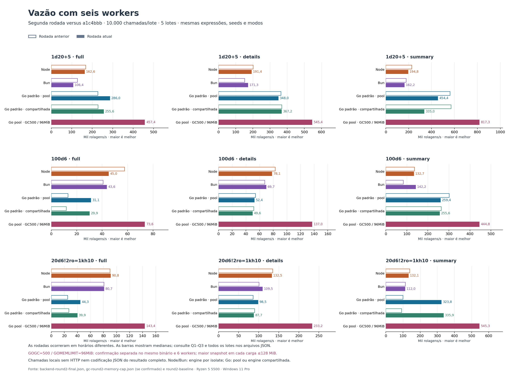
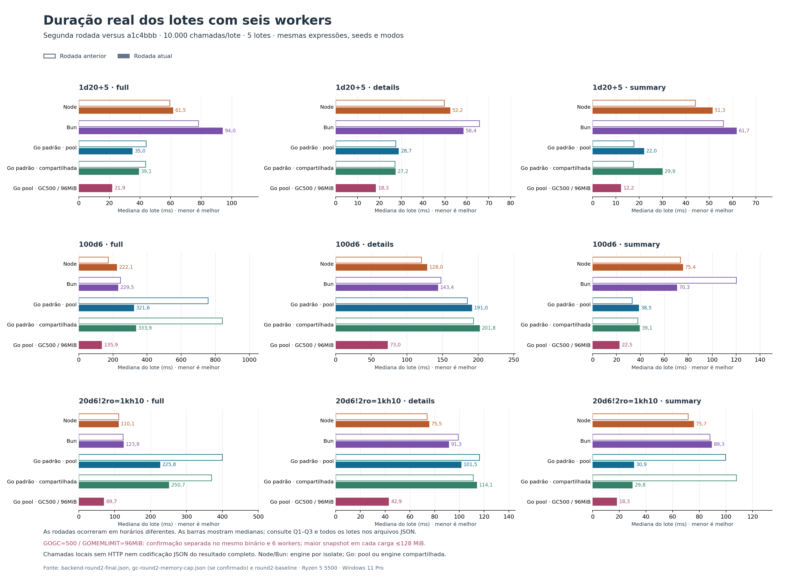
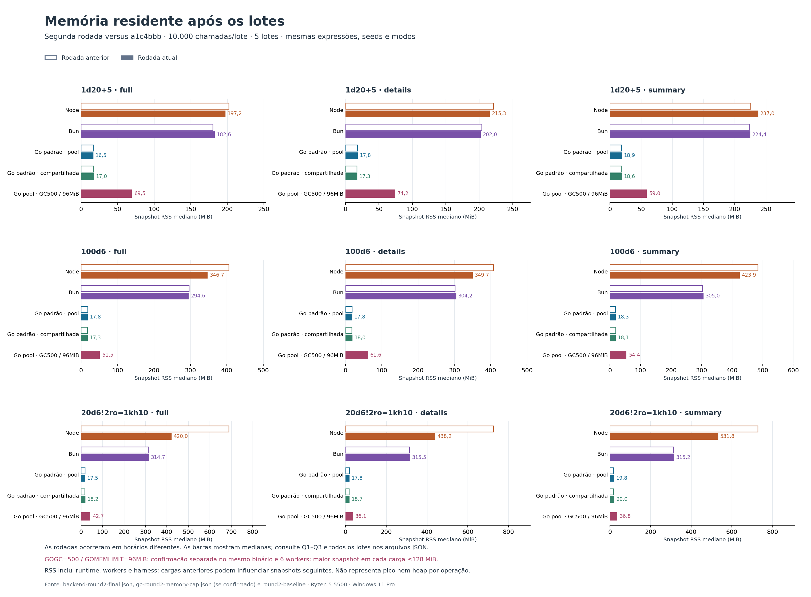

# Segunda rodada: lotes com seis workers

Medição de chamadas locais da biblioteca com seeds únicas, sem HTTP, sockets ou Discord. Cada lote conclui 10.000 rolagens; todos os runtimes recebem as mesmas expressões, modos, índices e seeds. Este experimento complementa as [17 cargas históricas](BENCHMARK.md), que continuam publicadas integralmente. A [rodada anterior completa](benchmarks/round2-baseline/go/BACKEND_BENCHMARK.md) preserva os resultados de 1/2/4/6 workers; este confronto repete as mesmas cargas, seeds, lotes e configuração de seis workers.

## Leitura principal

**Go padrão superou Node e Bun em cinco das nove cargas. Com GOGC=500 e GOMEMLIMIT=96MiB, a confirmação teve maior mediana nas nove cargas.** A configuração ajustada usa uma engine por worker e é uma opção do processo; nenhum GC global foi alterado na biblioteca. Essa coluna vem de uma confirmação separada no mesmo binário, depois de controle e seleção explicitamente documentados em [GC_ROUND2_TUNING.md](GC_ROUND2_TUNING.md).

| Carga | Node ops/s | Bun ops/s | Go padrão pool | Go padrão compartilhada | Go pool GOGC500 / GOMEMLIMIT96MiB |
|---|---:|---:|---:|---:|---:|
| 1d20+5 · full | 162.582 | 106.429 | 285.983 | 255.573 | 457.406 |
| 1d20+5 · details | 191.444 | 171.310 | 348.023 | 367.158 | 545.441 |
| 1d20+5 · summary | 194.775 | 162.199 | 454.391 | 334.956 | 817.294 |
| 100d6 · full | 45.025 | 43.565 | 31.098 | 29.949 | 73.606 |
| 100d6 · details | 78.147 | 69.729 | 52.365 | 49.552 | 137.037 |
| 100d6 · summary | 132.698 | 142.237 | 259.444 | 255.575 | 444.775 |
| 20d6!2ro=1kh10 · full | 90.814 | 80.726 | 44.292 | 39.884 | 143.425 |
| 20d6!2ro=1kh10 · details | 132.475 | 109.513 | 98.524 | 87.661 | 233.202 |
| 20d6!2ro=1kh10 · summary | 132.094 | 112.033 | 323.833 | 335.894 | 545.280 |

O padrão continua atrás em 100d6/full, 100d6/details e pool/full/details. O teste GOGC500 sem limite suave de memória foi reprovado: sua confirmação registrou 226,48 MiB em pool/full. A extensão com limite de 96MiB ficou com maior snapshot RSS de 78,44 MiB entre todas as cargas. GOMEMLIMIT é um limite suave do runtime; não garante esse RSS nem limita diretamente a memória residente do processo.

Há também regressões observadas frente ao baseline anterior: 1d20+5 · summary: pool 561.044 → 454.391 ops/s; compartilhada 569.755 → 334.956 ops/s; 100d6 · summary: pool 301.201 → 259.444 ops/s; compartilhada 263.868 → 255.575 ops/s. Os horários diferem, portanto não se atribui essa variação a uma alteração isolada; os valores antigos aparecem em contorno nos gráficos e continuam nos dados preservados.

**O resultado de nove vitórias vale para chamadas sem codificação JSON.** No [ensaio que constrói o resultado e JSON](JSON_BENCHMARK.md), a configuração ajustada superou ambos os runtimes em uma das três cargas; os dois payloads maiores continuam favorecendo JavaScript. Esta comparação não mede HTTP.

## Ambiente

AMD Ryzen 5 5500 · Windows 11 Pro · x64 · 12 CPUs lógicas. Node v24.18.0; Bun 1.4.0; go version go1.26.2 windows/amd64. Commit-base `a1c4bbb0a525de5d9f9b5f383be26bf867d79e1d`, com 35 entradas alteradas/não rastreadas. Manifesto estável: `e3f889b34ab89576b293e0a608fe6d1e3f2076036b31b886a58ac970e780cfbd`. Execução concluída em 2026-09-14T02:29:43.233Z, com 41,17 s de duração total.

## Método e equivalência

São 5 lotes por carga/configuração, com 6 workers. Cada configuração mantém o processo, as engines e os workers durante os lotes; cada carga aquece 5.000 chamadas por worker uma vez antes dos lotes. Processos, imports, criação de engines, seeds e aquecimento ficam fora do cronômetro. A ordem nesta execução é Node, Bun, Go pool e Go compartilhada; runtimes distintos não medem simultaneamente.

O timer mede o tempo real do início da liberação/envio do lote até a confirmação de conclusão de todos os workers. Inclui despacho e retorno dos contadores agregados. Cada chamada constrói o resultado do modo escolhido; serialização JSON e transferência de cada resultado completo para outro processo não são medidas. Node/Bun usam worker_threads com uma engine por isolate. Go usa goroutines e preserva o GOMAXPROCS padrão/configurado, registrado nos dados brutos; `go-pool` usa uma engine por worker e `go-shared` compartilha uma engine, incluindo eventual contenção do cache. Não há restrição de afinidade ou quota de CPU em nenhum runtime.

MT19937, limites padrão, cache aquecido e freezeResults='never' em todos. A seed de índice i é `dicecore-backend/v3.7.1/` + i; são 10.000 seeds distintas por lote. O conjunto é repetido nos lotes para comparabilidade. Warmup não é contado como trabalho entregue. Os índices são divididos em passos do número de workers, sem perder ou duplicar chamadas.

O preflight comparou JSON completo de 108 resultados por configuração e passou nos quatro modos de runtime e em todos os números de workers. Cada lote medido também confirmou contagem, soma dos totais, soma ponderada pelo índice e chamadas aleatórias, iguais entre runtimes e configurações. Esses contadores detectam divergências de entrega, mas não substituem a suíte de conformidade nem constituem hash criptográfico dos resultados.

## Resultados

Cada célula mostra **operações/s / mediana do lote em ms [Q1–Q3]**. Maior throughput e menor duração indicam melhor desempenho. Os quartis são entre lotes; não representam p95 de requisições individuais. Tempo amortizado por chamada está no JSON, sem interpretá-lo como latência de uma chamada concorrente.

| Carga | Workers | Node | Bun | Go pool | Go compartilhada |
|---|---:|---:|---:|---:|---:|
| 1d20+5 · full | 6 | 162.582 / 61,51 [59,36–62,24] | 106.429 / 93,96 [88,40–100,66] | 285.983 / 34,97 [34,84–36,84] | 255.573 / 39,13 [38,19–40,10] |
| 1d20+5 · details | 6 | 191.444 / 52,23 [50,87–58,21] | 171.310 / 58,37 [57,70–59,99] | 348.023 / 28,73 [28,38–30,34] | 367.158 / 27,24 [26,79–30,44] |
| 1d20+5 · summary | 6 | 194.775 / 51,34 [46,18–56,28] | 162.199 / 61,65 [60,87–68,42] | 454.391 / 22,01 [20,37–23,18] | 334.956 / 29,85 [22,09–32,40] |
| 100d6 · full | 6 | 45.025 / 222,10 [211,47–223,01] | 43.565 / 229,54 [229,26–235,51] | 31.098 / 321,56 [302,41–325,34] | 29.949 / 333,90 [320,35–365,48] |
| 100d6 · details | 6 | 78.147 / 127,96 [126,98–137,83] | 69.729 / 143,41 [141,84–154,45] | 52.365 / 190,97 [187,08–193,86] | 49.552 / 201,81 [195,27–209,09] |
| 100d6 · summary | 6 | 132.698 / 75,36 [74,53–84,29] | 142.237 / 70,31 [69,74–78,11] | 259.444 / 38,54 [37,99–41,70] | 255.575 / 39,13 [32,59–42,21] |
| 20d6!2ro=1kh10 · full | 6 | 90.814 / 110,12 [101,08–110,43] | 80.726 / 123,88 [120,54–134,36] | 44.292 / 225,78 [221,73–235,00] | 39.884 / 250,73 [248,38–261,18] |
| 20d6!2ro=1kh10 · details | 6 | 132.475 / 75,49 [74,58–77,91] | 109.513 / 91,31 [91,02–92,78] | 98.524 / 101,50 [99,62–104,87] | 87.661 / 114,08 [104,72–120,33] |
| 20d6!2ro=1kh10 · summary | 6 | 132.094 / 75,70 [72,36–75,94] | 112.033 / 89,26 [87,30–89,44] | 323.833 / 30,88 [30,68–30,93] | 335.894 / 29,77 [28,79–30,46] |

## Gráficos





[Throughput SVG](benchmarks/backend-round2-throughput.svg) · [Duração SVG](benchmarks/backend-round2-batches.svg).

## Memória residente do processo

Snapshots RSS, em MiB: **após aquecimento / mediana após lotes / maior snapshot após lotes**. Node/Bun usam process.memoryUsage().rss; Go Windows usa GetProcessMemoryInfo.WorkingSetSize (Linux: /proc/self/statm). Incluem runtime, workers, caches e estruturas compactas de seeds/options pré-criadas pelo harness. São valores absolutos, sem subtrair o snapshot inicial. O processo percorre cargas sucessivas; memória reservada ou retida de cargas anteriores pode influenciar as seguintes. As leituras acontecem fora do timer, com GC natural. O maior snapshot observado não é o pico real do processo; transientes entre leituras e pico de startup não foram amostrados. Não se comparam heaps JS/Go nem B/op entre linguagens.

| Carga | Workers | Node | Bun | Go pool | Go compartilhada |
|---|---:|---:|---:|---:|---:|
| 1d20+5 · full | 6 | 189,80 / 197,20 / 207,67 | 167,77 / 182,64 / 185,46 | 16,21 / 16,53 / 17,49 | 15,70 / 16,98 / 17,89 |
| 1d20+5 · details | 6 | 194,52 / 215,26 / 223,86 | 202,70 / 201,95 / 203,70 | 16,39 / 17,77 / 18,23 | 17,32 / 17,28 / 18,45 |
| 1d20+5 · summary | 6 | 235,49 / 237,01 / 248,32 | 222,71 / 224,38 / 230,56 | 18,96 / 18,90 / 19,24 | 29,29 / 18,57 / 21,93 |
| 100d6 · full | 6 | 282,31 / 346,69 / 348,51 | 294,13 / 294,64 / 295,72 | 16,84 / 17,79 / 18,32 | 17,51 / 17,31 / 18,14 |
| 100d6 · details | 6 | 349,63 / 349,72 / 351,30 | 296,77 / 304,18 / 304,21 | 18,30 / 17,82 / 18,14 | 17,55 / 17,97 / 18,86 |
| 100d6 · summary | 6 | 385,93 / 423,85 / 446,27 | 304,92 / 305,03 / 321,45 | 18,30 / 18,30 / 22,83 | 16,96 / 18,09 / 19,06 |
| 20d6!2ro=1kh10 · full | 6 | 410,29 / 419,95 / 426,55 | 315,47 / 314,71 / 315,20 | 18,16 / 17,55 / 18,97 | 17,32 / 18,19 / 18,65 |
| 20d6!2ro=1kh10 · details | 6 | 431,29 / 438,24 / 465,29 | 316,20 / 315,49 / 316,07 | 18,56 / 17,77 / 18,70 | 17,63 / 18,70 / 18,90 |
| 20d6!2ro=1kh10 · summary | 6 | 531,54 / 531,80 / 534,66 | 315,16 / 315,18 / 315,21 | 19,27 / 19,84 / 20,31 | 19,98 / 19,98 / 20,30 |



[RSS em SVG](benchmarks/backend-round2-rss.svg).

## Reprodução e dados

```powershell
node scripts/compare-backend-round2.mjs --go 'C:\Users\quira\.codex\visualizations\2026\07\21\019f8591-c4eb-7913-9683-054308852112\go-runtime-full\go\bin\go.exe' --bun 'bun'
python scripts/plot-backend-round2.py
```

Requer Node, Bun, Go e dependências npm instaladas; gráficos usam matplotlib==3.10.8. `--quick` usa 1.024 chamadas, cinco lotes e warmup reduzido. `--preflight-only` só compara resultados. Modos de desenvolvimento gravam em .artifacts/optimization-round2/backend-calibration. Limite rígido de cinco minutos por execução.

[Medições e manifesto](benchmarks/backend-round2-final.json) · [Preflight integral](benchmarks/backend-preflight-round2-final.json.gz) · [Orquestrador](../scripts/compare-backend-round2.mjs).

## Limitações

Microbenchmark em Windows compartilhado com ferramentas de desenvolvimento. GC natural, JIT, escalonamento e frequência da CPU influenciam os números. Engines isoladas e uma engine compartilhada representam arquiteturas diferentes, explicitadas nas colunas. Não há comparação de alocações entre linguagens, rede, latência de ponta a ponta de servidor nem mistura de clientes reais. Escalar workers aumenta paralelismo, mas não garante ganho linear.
