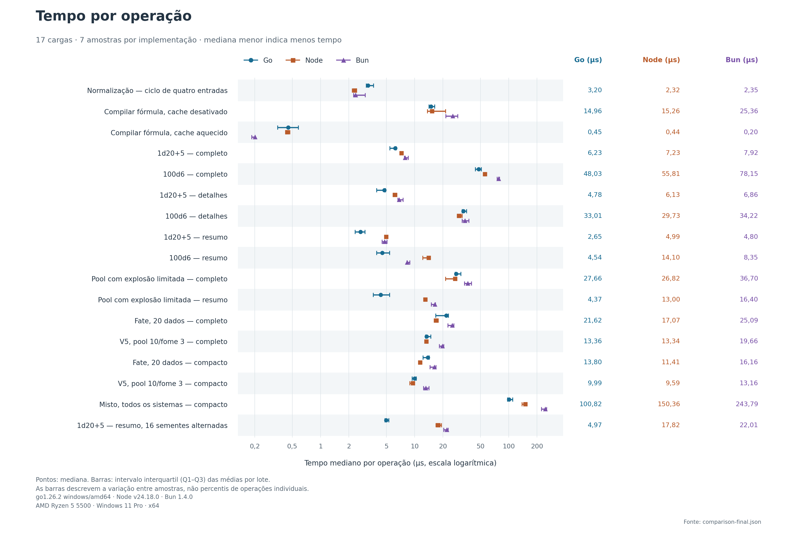
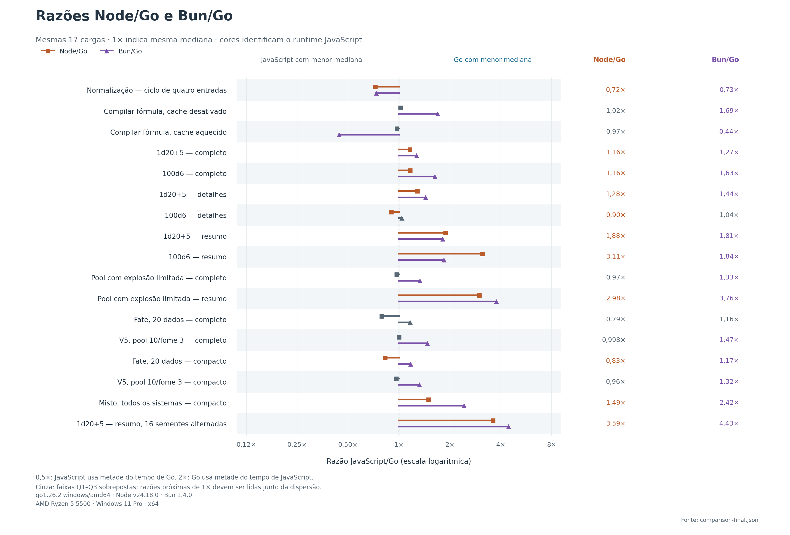

# Benchmark: Go, TypeScript no Node e TypeScript no Bun

Execução em 2026-09-14T02:40:43.099Z. Comparação de APIs locais da biblioteca v3.7.1, sem HTTP ou Discord. As 17 cargas originais foram preservadas. Em 9 cargas a mediana de Go foi menor que a do Node; consulte a dispersão antes de interpretar diferenças pequenas. Isso descreve estas cargas e esta máquina; não estima ganho do Fortuna em produção. O [baseline original](benchmarks/baseline/README.md) e a [rodada anterior com Node/Bun](benchmarks/round2-baseline/README.md) permanecem preservados.

## Ambiente e versão

- CPU: AMD Ryzen 5 5500; 12 processadores lógicos.
- Sistema: Windows 11 Pro; x64.
- Memória instalada: 31,87 GiB.
- Runtimes: Node v24.18.0; Bun 1.4.0; go version go1.26.2 windows/amd64. Node e Bun executam o mesmo bundle TypeScript compilado.
- Commit-base: `a1c4bbb0a525de5d9f9b5f383be26bf867d79e1d`. Árvore com 41 entradas alteradas/não rastreadas; manifesto SHA-256 nos dados brutos.
- SHA-256 conjunto: `90c318c2472881cdc78df92c507e6774b81245c84e2cfefaa275ad03a2c20daf`. Conferido novamente ao terminar, sem alteração.
- Variáveis de runtime: `{"NODE_OPTIONS":null,"GOMAXPROCS":null,"GOGC":null,"GOMEMLIMIT":null}`.

## Método

O harness compilou o executável Go de teste e o bundle TypeScript antes das medições. O preflight comparou o JSON completo de 35 resultados entre os runtimes e passou para todas as cargas. Compilação, inicialização de processo, carregamento de módulos, preparação de engines e serialização do resultado ficaram fora dos cronômetros.

Foram 7 rodadas, produzindo uma amostra por runtime/carga em cada rodada. Cada runtime inicia um processo novo por rodada e percorre todas as cargas; cada carga tem aquecimento explícito seguido de um lote medido. O tamanho do lote é igual para Go e TypeScript na mesma carga, calibrado para aproximadamente 50 ms no runtime mais rápido, limitado a 500.000 operações. O aquecimento executa no mínimo 5000 e no máximo 20.000 chamadas, conforme o tamanho do lote.

Go, Node e Bun não executam medições simultâneas. A ordem entre runtimes e a ordem das cargas alternam entre rodadas. Coleta de lixo fica no funcionamento natural de cada runtime; não há GC forçada. O limite global de execução é cinco minutos. A implementação fica estável durante cada execução; as otimizações anteriores estão identificadas pelo manifesto.

As expressões, modos de resultado, limites padrão, algoritmo MT19937, políticas de cache e seeds são iguais. Todas as engines usam `freezeResults: 'never'`. A maioria das cargas usa seed fixa; a última alterna 16 seeds. Repetir uma seed pode favorecer caches de inicialização do gerador. Seeds únicas, lotes de milhares e concorrência são medidos separadamente em [BACKEND_BENCHMARK.md](BACKEND_BENCHMARK.md). Rolagens sem seed e obtenção de entropia não foram medidas.

## Resultados

Mediana e intervalo interquartil Q1–Q3 dos tempos médios de lote, em **ns/op**. A razão **TS/Go** maior que 1 favorece Go; menor que 1 favorece TypeScript. Ops/s é o inverso da mediana.

| Carga | Node [Q1–Q3], ns/op | Bun [Q1–Q3], ns/op | Go [Q1–Q3], ns/op | Node ops/s | Bun ops/s | Go ops/s | Node/Go | Bun/Go |
|---|---:|---:|---:|---:|---:|---:|---:|---:|
| Normalização — ciclo de quatro entradas | 2.317 [2.170–2.394] | 2.353 [2.243–2.983] | 3.204 [3.060–3.656] | 431.623 | 425.062 | 312.121 | 0,72× | 0,73× |
| Compilar fórmula, cache desativado | 15.257 [13.689–21.258] | 25.355 [21.392–28.753] | 14.960 [14.152–16.279] | 65.543 | 39.439 | 66.843 | 1,02× | 1,69× |
| Compilar fórmula, cache aquecido | 441 [430–472] | 201 [185–202] | 454 [350–582] | 2.268.251 | 4.982.978 | 2.200.564 | 0,97× | 0,44× |
| 1d20+5 — full | 7.226 [7.053–7.466] | 7.919 [7.745–8.544] | 6.233 [5.429–6.337] | 138.391 | 126.286 | 160.435 | 1,16× | 1,27× |
| 100d6 — full | 55.812 [55.586–56.253] | 78.153 [75.340–79.555] | 48.033 [44.109–51.033] | 17.917 | 12.795 | 20.819 | 1,16× | 1,63× |
| 1d20+5 — details | 6.129 [5.975–6.448] | 6.860 [6.643–7.514] | 4.776 [3.951–4.874] | 163.159 | 145.777 | 209.381 | 1,28× | 1,44× |
| 100d6 — details | 29.727 [28.302–31.946] | 34.223 [31.943–37.549] | 33.010 [32.020–35.570] | 33.640 | 29.220 | 30.294 | 0,90× | 1,04× |
| 1d20+5 — summary | 4.990 [4.807–5.177] | 4.796 [4.500–5.062] | 2.654 [2.322–2.966] | 200.410 | 208.514 | 376.826 | 1,88× | 1,81× |
| 100d6 — summary | 14.101 [12.215–14.493] | 8.346 [8.253–8.847] | 4.537 [3.942–5.422] | 70.917 | 119.816 | 220.431 | 3,11× | 1,84× |
| Pool com explosão limitada — full | 26.821 [21.241–27.850] | 36.703 [33.862–40.217] | 27.664 [26.833–31.018] | 37.284 | 27.246 | 36.149 | 0,97× | 1,33× |
| Pool com explosão limitada — summary | 13.001 [12.679–13.138] | 16.401 [15.039–16.566] | 4.368 [3.623–5.410] | 76.916 | 60.971 | 228.950 | 2,98× | 3,76× |
| Fate, 20 dados — full | 17.073 [16.078–17.231] | 25.094 [22.558–26.015] | 21.620 [16.699–22.859] | 58.573 | 39.851 | 46.254 | 0,79× | 1,16× |
| V5, pool 10/fome 3 — full | 13.336 [13.273–13.615] | 19.658 [18.305–20.409] | 13.362 [13.031–14.828] | 74.986 | 50.871 | 74.840 | 1,00× | 1,47× |
| Fate, 20 dados — compact | 11.408 [11.046–11.569] | 16.162 [14.513–16.782] | 13.797 [12.223–14.287] | 87.654 | 61.873 | 72.479 | 0,83× | 1,17× |
| V5, pool 10/fome 3 — compact | 9.593 [8.870–9.868] | 13.162 [12.424–14.152] | 9.989 [9.375–10.372] | 104.245 | 75.974 | 100.113 | 0,96× | 1,32× |
| Misto, todos os sistemas — compact | 150.365 [138.408–154.792] | 243.789 [221.607–251.814] | 100.824 [97.025–110.292] | 6.651 | 4.102 | 9.918 | 1,49× | 2,42× |
| 1d20+5 — summary, 16 seeds alternadas | 17.822 [16.813–19.271] | 22.013 [20.388–22.668] | 4.969 [4.818–5.317] | 56.111 | 45.428 | 201.254 | 3,59× | 4,43× |

Q1–Q3 mostra dispersão entre lotes, não intervalo de confiança. Os lotes não medem latência individual de requisição; não há p95 de requisições nesta tabela. As amostras, durações, warmups e quantidades exatas por carga estão no JSON original.

## Leitura da segunda rodada

Go apresentou menor mediana em 9/17 cargas contra Node e 15/17 contra Bun. Essa contagem não testa significância: há sobreposição de Q1–Q3 em comparações próximas de 1×, como compilação e V5/full. Normalização e cache quente continuam favorecendo Bun; Fate/full e Fate/compacto continuam favorecendo Node.

Com a mesma seed repetida, 100d6/full caiu de 124,39 para 48,03 µs em Go. As políticas de seeds são parte da carga; esse resultado não substitui a medição de [backend com seeds únicas](BACKEND_ROUND2_BENCHMARK.md), nem a de [construção com JSON](JSON_BENCHMARK.md). Não há uma vitória universal sobre TypeScript.

Comparação adicional contra a rodada imediatamente anterior, commit a1c4bbb. Razão maior que 1 favorece a versão atual. Execuções em horários diferentes não isolam causalidade de uma mudança específica.

| Carga | Go a1c4bbb, ns/op | Go atual, ns/op | Antes/depois |
|---|---:|---:|---:|
| Normalização — ciclo de quatro entradas | 3.049,07 | 3.203,89 | 0,95× |
| Compilar fórmula, cache desativado | 13.738,08 | 14.960,37 | 0,92× |
| Compilar fórmula, cache aquecido | 390,35 | 454,43 | 0,86× |
| 1d20+5 — full | 10.320,43 | 6.233,04 | 1,66× |
| 100d6 — full | 124.389,24 | 48.033,20 | 2,59× |
| 1d20+5 — details | 7.218,88 | 4.775,99 | 1,51× |
| 100d6 — details | 34.663,51 | 33.010,03 | 1,05× |
| 1d20+5 — summary | 5.080,08 | 2.653,74 | 1,91× |
| 100d6 — summary | 7.229,92 | 4.536,57 | 1,59× |
| Pool com explosão limitada — full | 44.800,83 | 27.663,57 | 1,62× |
| Pool com explosão limitada — summary | 13.343,87 | 4.367,77 | 3,06× |
| Fate, 20 dados — full | 40.131,46 | 21.619,65 | 1,86× |
| V5, pool 10/fome 3 — full | 28.251,21 | 13.361,89 | 2,11× |
| Fate, 20 dados — compact | 18.066,35 | 13.797,12 | 1,31× |
| V5, pool 10/fome 3 — compact | 13.685,75 | 9.988,72 | 1,37× |
| Misto, todos os sistemas — compact | 116.846,42 | 100.823,70 | 1,16× |
| 1d20+5 — summary, 16 seeds alternadas | 4.978,66 | 4.968,85 | 1,00× |

## Gráficos





Versões vetoriais para exportar: [tempos por operação](benchmarks/latency.svg) e [razões TS/Go](benchmarks/speedup.svg). Os gráficos usam os mesmos dados da tabela.

## Go antes e depois

Mesmas 17 cargas e seed/mode/cache do baseline. Razão maior que 1 indica redução do tempo de Go nesta execução; as execuções aconteceram em horários diferentes.

| Carga | Go baseline, ns/op | Go atual, ns/op | Antes/depois |
|---|---:|---:|---:|
| Normalização — ciclo de quatro entradas | 3.152 | 3.204 | 0,98× |
| Compilar fórmula, cache desativado | 13.946 | 14.960 | 0,93× |
| Compilar fórmula, cache aquecido | 1.255 | 454 | 2,76× |
| 1d20+5 — full | 19.126 | 6.233 | 3,07× |
| 100d6 — full | 214.196 | 48.033 | 4,46× |
| 1d20+5 — details | 14.862 | 4.776 | 3,11× |
| 100d6 — details | 133.041 | 33.010 | 4,03× |
| 1d20+5 — summary | 10.954 | 2.654 | 4,13× |
| 100d6 — summary | 13.105 | 4.537 | 2,89× |
| Pool com explosão limitada — full | 75.088 | 27.664 | 2,71× |
| Pool com explosão limitada — summary | 41.445 | 4.368 | 9,49× |
| Fate, 20 dados — full | 60.584 | 21.620 | 2,80× |
| V5, pool 10/fome 3 — full | 42.317 | 13.362 | 3,17× |
| Fate, 20 dados — compact | 41.877 | 13.797 | 3,04× |
| V5, pool 10/fome 3 — compact | 30.426 | 9.989 | 3,05× |
| Misto, todos os sistemas — compact | 157.378 | 100.824 | 1,56× |
| 1d20+5 — summary, 16 seeds alternadas | 10.909 | 4.969 | 2,20× |

## Cargas

| ID | Operação | Entrada | Modo | Cache |
|---|---|---|---|---|
| normalize | normalize | Ciclo de quatro entradas no JSON | — | — |
| compile-cold | compile | `2#4d6kh3+1d8` | — | desativado |
| compile-hot | compile | `2#4d6kh3+1d8` | — | aquecido |
| d20-full | roll | `1d20+5` | full | aquecido |
| 100d6-full | roll | `100d6` | full | aquecido |
| d20-details | roll | `1d20+5` | details | aquecido |
| 100d6-details | roll | `100d6` | details | aquecido |
| d20-summary | roll | `1d20+5` | summary | aquecido |
| 100d6-summary | roll | `100d6` | summary | aquecido |
| pool-full | roll | `20d6!2ro=1kh10` | full | aquecido |
| pool-summary | roll | `20d6!2ro=1kh10` | summary | aquecido |
| fate-full | fate | `{"dice":20}` | full | aquecido |
| v5-full | vampire-v5 | `{"pool":10,"hunger":3,"difficulty":4}` | full | aquecido |
| fate-compact | fate | `{"dice":20}` | compact | aquecido |
| v5-compact | vampire-v5 | `{"pool":10,"hunger":3,"difficulty":4}` | compact | aquecido |
| mixed-compact | mixed | `2d20kh1; fate(4); v5(7,3,4); assim(d6=2,d10=1,d12=1,keep=1); dh(2,15)` | compact | aquecido |
| d20-changing-seed | roll | `1d20+5` | summary | aquecido |

Cada operação de normalização processa uma única entrada; os lotes percorrem as quatro entradas em ciclo. No caso de compilação sem cache, a engine é criada antes de cronometrar e cada operação refaz o trabalho de análise/compilação. No caso aquecido, cada operação chama a API pública de compilação; Go também entrega a cópia de plano exigida por seu contrato de propriedade. Rolagens usam entradas textuais com cache aquecido, não um atalho interno de executor.

## Reprodução e dados originais

A partir da raiz do repositório, com Node 24.18.0, Go 1.26.2 e as dependências npm instaladas:

```powershell
node scripts/compare-go-typescript.mjs --go 'C:\Users\quira\.codex\visualizations\2026\07\21\019f8591-c4eb-7913-9683-054308852112\go-runtime-full\go\bin\go.exe'
```

Para verificar o harness rapidamente, acrescente `--quick`; esse modo grava dados separados e não substitui este relatório. `--preflight-only` executa somente a verificação de resultados, após os builds.

- [Medições, metadados e manifesto](benchmarks/comparison-final.json).
- [JSON integral dos resultados usados no preflight](benchmarks/preflight-final.json).
- [Orquestrador](../scripts/compare-go-typescript.mjs), [worker TypeScript](../scripts/benchmark-go-reference.mjs) e [worker Go](benchmark_test.go).

Os modos de desenvolvimento gravam seus dados em `.artifacts/benchmark-calibration/`, preservando as medições finais.

Para regenerar os gráficos sem repetir as medições, use Python com `matplotlib` instalado:

```powershell
python scripts/plot-go-benchmark.py
```

O [script dos gráficos](../scripts/plot-go-benchmark.py) lê os dados finais preservados no repositório.

## Limitações

É um microbenchmark de biblioteca em uma máquina Windows compartilhada com aplicações de desenvolvimento. JIT, GC, frequência da CPU e processos externos podem influenciar as amostras. O experimento mede as implementações atuais, incluindo seus custos de validação, alocação e propriedade de dados; não isola o efeito da linguagem. Comparações próximas de 1× exigem atenção à dispersão e nova repetição em ambiente controlado.

Neste experimento sequencial não há medição comparável de memória: Go B/op e crescimento de heap JavaScript têm definições diferentes. Os [snapshots RSS do backend](BACKEND_ROUND2_BENCHMARK.md) estão em um experimento separado. O preflight demonstra igualdade destas cargas; a conformidade completa pertence à suíte de testes da migração.
