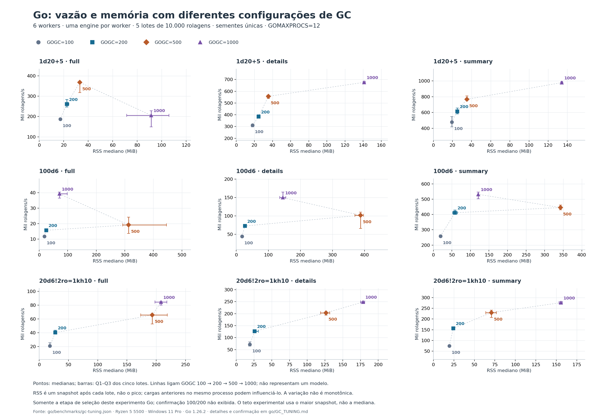

# Configuração opcional de GC para o backend

`GOGC=200` aumentou o throughput de `100d6` full em **33,2%** no confronto
de confirmação: **13.070 → 17.412 rolagens/s**, com seis workers. O RSS mediano
dessa carga passou de **18,73 → 22,84 MiB**. A biblioteca mantém o comportamento
padrão do runtime: nenhuma chamada global a `debug.SetGCPercent` foi adicionada.

Isso não torna Go vencedor de todas as cargas. No benchmark padrão,
Node alcançou 57.587 rolagens/s em `100d6` full com seis workers, ainda acima
das configurações Go testadas. Consulte os [resultados padrão completos](BACKEND_BENCHMARK.md).

## Experimento e escolha

Após as 12 hipóteses de código do [registro de otimização](OPTIMIZATION.md),
foi testada uma hipótese adicional de configuração: aumentar a meta do GC
poderia recuperar throughput das cargas que alocam muitos resultados, ao custo
de mais memória residente. Foram três candidatas: `GOGC=200`, `500` e `1000`.

O experimento durou 60,48 s, dentro do orçamento de 180 s. Usou o mesmo
executável Go congelado do benchmark padrão, seis goroutines com uma engine
por worker, as nove cargas, cinco lotes de 10.000 chamadas e 5.000 chamadas de
aquecimento por worker. Seeds, projeções e resultados são os mesmos. Todas as
contagens e digests conferiram; os hashes das fontes e do executável foram
verificados. Nenhum outro benchmark foi executado simultaneamente.

A ordem foi `100 → 200 → 500 → 1000`, seguida por `200 → 100` para confirmação.
Antes da seleção, o critério foi definido: maior throughput em `100d6` full,
com **todos os snapshots RSS pós-lote das nove cargas até 128 MiB**. Esse é
um critério experimental de escolha, **não um limite imposto ao processo nem
garantia de pico de memória**. Nenhum `GOMEMLIMIT` foi configurado.

| GOGC, seleção | `100d6` full, rolagens/s | RSS mediano dessa carga | Maior snapshot de todas as cargas | Decisão |
| ---: | ---: | ---: | ---: | --- |
| 100 | 11.767 | 17,94 MiB | 21,13 MiB | Controle |
| 200 | 15.734 | 24,46 MiB | 73,39 MiB | Selecionada e confirmada |
| 500 | 19.192 | 313,27 MiB | 483,55 MiB | Ultrapassou o critério de RSS |
| 1000 | 39.313 | 70,71 MiB | 229,66 MiB | Ultrapassou o critério de RSS em outras cargas |

RSS não variou de forma monotônica com GOGC neste experimento. Cada processo
percorre as cargas em sequência; alocações anteriores, coleta e devolução de
páginas ao sistema influenciam os snapshots. `500` e `1000` foram medidos na
seleção, sem a confirmação adicional feita para `200`. Seus ganhos não devem
ser apresentados como uma configuração validada sob o critério escolhido.



[Gráfico vetorial](benchmarks/gc-tradeoff.svg). O gráfico apresenta os quatro
valores da seleção; a tabela seguinte usa o confronto de confirmação.

## Confirmação: todos os modos

Medianas de cinco lotes por carga. RSS é a mediana dos snapshots após os lotes.
O maior snapshot da confirmação com GOGC=200 foi 29,98 MiB; na seleção foi
73,39 MiB. Esses valores não são picos contínuos do processo.

| Carga | GOGC=100, ops/s | GOGC=200, ops/s | Mudança de throughput | RSS mediano, 100 → 200 |
| --- | ---: | ---: | ---: | ---: |
| `1d20+5` full | 219.350 | 301.438 | +37,4% | 16,95 → 21,10 MiB |
| `1d20+5` details | 342.245 | 332.626 | −2,8% | 17,86 → 22,68 MiB |
| `1d20+5` summary | 488.272 | 636.485 | +30,4% | 18,65 → 23,92 MiB |
| `100d6` full | 13.070 | 17.412 | +33,2% | 18,73 → 22,84 MiB |
| `100d6` details | 54.320 | 72.576 | +33,6% | 18,94 → 25,36 MiB |
| `100d6` summary | 260.510 | 441.170 | +69,3% | 19,33 → 22,84 MiB |
| Pool full | 28.012 | 40.434 | +44,3% | 17,99 → 22,68 MiB |
| Pool details | 86.983 | 130.276 | +49,8% | 18,78 → 22,27 MiB |
| Pool summary | 105.296 | 159.291 | +51,3% | 18,54 → 22,58 MiB |

Pool é `20d6!2ro=1kh10`. O alvo melhorou nas duas etapas, e oito das nove
medianas melhoraram na confirmação. `1d20+5` details teve mediana 2,8% menor
de throughput; essa diferença pequena e a variação entre etapas impedem
afirmar ganho universal. As amostras integrais estão nos dados brutos.

## Uso e reprodução

Para avaliar essa configuração ao iniciar o futuro backend, em PowerShell:

```powershell
$env:GOGC = '200'
.\backend.exe
```

A opção afeta o processo inteiro, incluindo outras partes do serviço. Este
teste mede a biblioteca; a configuração do serviço deve considerar a mistura
real de operações e seu orçamento de memória. API, resultados e algoritmo de
rolagem não mudam com essa configuração.

Para reproduzir o experimento, primeiro gere a referência e o executável
congelado na mesma máquina e no mesmo checkout; depois execute a seleção:

```powershell
# Requer os executáveis Go, Bun e Node disponíveis e dependências npm instaladas.
node scripts/compare-backend-runtimes.mjs --go go --bun bun
node scripts/compare-go-gc.mjs
python scripts/plot-go-gc.py
```

Não configure `GOMEMLIMIT` nesse confronto. O script exige o mesmo
`GOMAXPROCS` e o mesmo binário da referência, registra cada `GOGC` e revalida
o critério após a confirmação. Os gráficos usam matplotlib 3.10.8.

[Dados, amostras, configurações e hashes](benchmarks/gc-tuning.json) ·
[Harness](../scripts/compare-go-gc.mjs).
