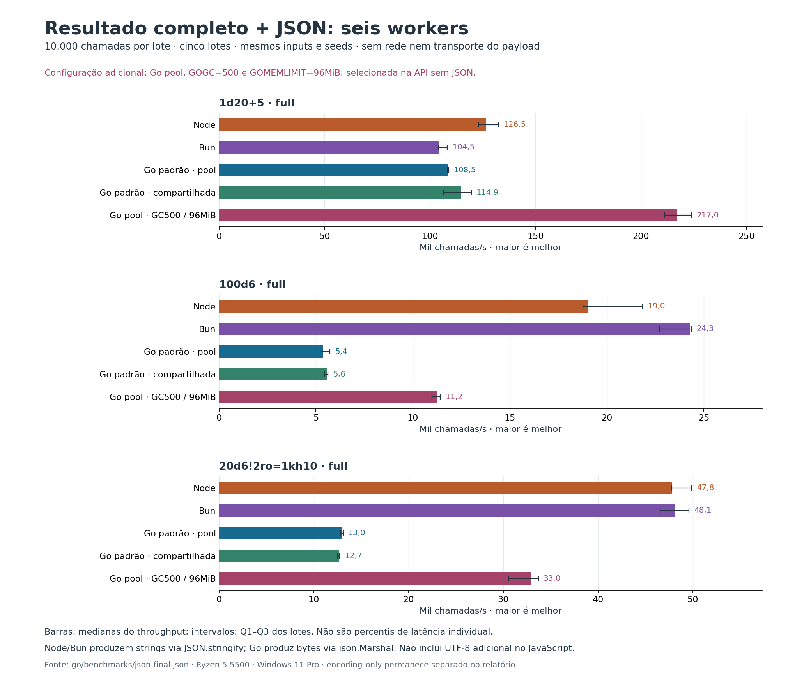

# Construção do resultado completo e serialização JSON

Este experimento mede a chamada full seguida por JSON.stringify (Node/Bun) ou encoding/json.Marshal (Go), usando a mesma biblioteca e os mesmos valores. Não há HTTP, sockets, envio do payload ou codificação adicional de strings JavaScript para buffers UTF-8. O resultado full e seu JSON são construídos em cada chamada do alvo principal. [Chamadas sem JSON](BACKEND_ROUND2_BENCHMARK.md) e [baseline anterior](benchmarks/round2-baseline/README.md) continuam separados.

## Leitura principal

**Incluindo JSON, Go com GOGC=500 e GOMEMLIMIT=96MiB venceu uma das três cargas contra Node e Bun.** A configuração padrão Go ficou atrás de Node nas três. Em 100d6, a configuração ajustada produziu 11.246 chamadas/s contra 19.039 no Node e 24.279 no Bun. O pool com modificadores também continua mais rápido nos runtimes JavaScript.

| Carga full, 6 workers | Node ops/s | Bun ops/s | Go padrão pool | Go padrão compartilhada | Go pool GOGC500 / GOMEMLIMIT96MiB |
|---|---:|---:|---:|---:|---:|
| 1d20+5 · full | 126.487 | 104.528 | 108.542 | 114.882 | 216.981 |
| 100d6 · full | 19.039 | 24.279 | 5.381 | 5.564 | 11.246 |
| 20d6!2ro=1kh10 · full | 47.803 | 48.067 | 12.994 | 12.662 | 32.960 |

O maior snapshot RSS da série ajustada foi 66,17 MiB. A vantagem da biblioteca sem serialização não permite afirmar vantagem em respostas HTTP. O diagnóstico encoding-only fica separado; ele não representa uma chamada completa da API.



[Gráfico em SVG](benchmarks/json-throughput.svg). Reprodução: `python scripts/plot-json-benchmark.py`, com matplotlib==3.10.8.

## Método e ambiente

AMD Ryzen 5 5500 · Windows 11 Pro · 12 CPUs lógicas. Node v24.18.0, Bun 1.4.0, go version go1.26.2 windows/amd64. Commit-base `a1c4bbb0a525de5d9f9b5f383be26bf867d79e1d`, árvore com 45 entradas modificadas. Manifesto estável `405fd5fa4349a9b90138ffb9c7461a2249d45f9d04e63d900e4a0662a2ca594d`.

As três expressões usam MT19937, limites padrão, full, cache aquecido, freezeResults='never' e seeds únicas `dicecore-backend/v3.7.1/` + índice. Workers de aplicação: 1 e 6; GOMAXPROCS permanece no padrão/configuração do processo e está registrado por execução. Node/Bun têm uma engine por isolate; Go pool usa uma por goroutine e Go compartilhada usa uma engine para todas. Os processos são sequenciais; a ordem dos runtimes gira entre configurações. Workers, engines e options persistem nos lotes.

Cada carga principal aquece 5000 chamadas por worker e mede 5 lotes de 10000 chamadas. Build, imports, startup, options e aquecimento ficam fora do cronômetro. O tempo real do lote inclui despacho e conclusão de todos os workers, construção dos resultados e JSON; só contadores agregados retornam ao coordenador. Os contadores usam len(bytes) em Go e string.length em JavaScript; o corpus usa somente texto ASCII, confirmado no preflight, portanto representam o comprimento UTF-8 dessas saídas. Não há normalização ou reordenação das chaves no caminho cronometrado.

O preflight decodifica cada JSON e exige igualdade integral dos valores e números, sem tolerância numérica. Diferenças textuais de ordem de chaves, escapes e representação numérica não são tratadas como divergência semântica; os comprimentos individuais ficam preservados no preflight. Cada lote confirma quantidade de chamadas, soma dos totais, soma ponderada pelo índice e chamadas aleatórias; o comprimento codificado é validado entre lotes do mesmo runtime, sem forçar igualdade entre serializadores.

## API completa: construir + codificar

Cada célula: **operações/s / mediana do lote em ms [Q1–Q3]**. Os quartis são entre lotes, não percentis de latência de requisições individuais.

| Carga | Workers | Node | Bun | Go pool | Go compartilhada |
|---|---:|---:|---:|---:|---:|
| 1d20+5 · full | 1 | 35.049,58 / 285,31 [284,98–290,27] | 34.585,25 / 289,14 [286,87–291,5] | 33.164,06 / 301,53 [254,51–311,87] | 52.422,96 / 190,76 [186,74–207] |
| 1d20+5 · full | 6 | 126.487,01 / 79,06 [75,54–81,38] | 104.527,61 / 95,67 [92,4–96,15] | 108.541,92 / 92,13 [91,84–92,25] | 114.881,79 / 87,05 [83,64–93,96] |
| 100d6 · full | 1 | 4.653,99 / 2.148,7 [2.113,87–2.160,97] | 5.629,86 / 1.776,24 [1.721,4–1.829,01] | 2.181,29 / 4.584,44 [4.473,54–4.586,67] | 2.263,98 / 4.417 [4.396,3–4.495,34] |
| 100d6 · full | 6 | 19.039,01 / 525,24 [457,81–533,08] | 24.278,65 / 411,88 [410,58–440,63] | 5.381,31 / 1.858,28 [1.749,98–1.902] | 5.564,19 / 1.797,21 [1.778,79–1.839,4] |
| 20d6!2ro=1kh10 · full | 1 | 11.972,22 / 835,27 [826,5–844,56] | 11.555,18 / 865,41 [859,86–898,42] | 6.261,09 / 1.597,17 [1.591,24–1.624,42] | 6.469,89 / 1.545,62 [1.542,55–1.546,36] |
| 20d6!2ro=1kh10 · full | 6 | 47.802,54 / 209,19 [200,54–209,22] | 48.066,78 / 208,04 [201,6–214,77] | 12.993,95 / 769,59 [763,88–780,55] | 12.662,14 / 789,76 [784,5–798,02] |

## Go com GC confirmado no experimento da API

Série adicional: Go pool, seis workers, GOGC=500, GOMEMLIMIT=96MiB, mesmas cargas e binário JSON. Essa configuração foi selecionada e confirmada no experimento da API sem JSON; aqui ela é apenas reaplicada, sem nova seleção. Os resultados padrão acima permanecem completos. O RSS observado com JSON pode diferir daquele experimento. Para reproduzir essa série, acrescente --with-confirmed-gc ao comando JSON após executar a seleção e confirmação do GC.

| Carga | Go padrão ops/s | Go GOGC=500 ops/s | Configurado/padrão | RSS configurado: mediana / maior snapshot MiB |
|---|---:|---:|---:|---:|
| 1d20+5 · full | 108.541,92 | 216.981,4 | 2× | 40,38 / 51,51 |
| 100d6 · full | 5.381,31 | 11.246,36 | 2,09× | 48,1 / 61,12 |
| 20d6!2ro=1kh10 · full | 12.993,95 | 32.960 | 2,54× | 49,61 / 66,17 |

## Tamanho médio do JSON por resultado

Comprimento emitido no corpus ASCII, com seis workers; diferença de tamanho não implica diferença dos valores JSON.

| Carga | Node | Bun | Go pool | Go compartilhada |
|---|---:|---:|---:|---:|
| 1d20+5 · full | 2.381,2 | 2.381,2 | 2.381,2 | 2.381,2 |
| 100d6 · full | 53.055 | 53.055 | 53.055 | 53.055 |
| 20d6!2ro=1kh10 · full | 15.330,36 | 15.330,36 | 15.330,36 | 15.330,36 |

## Codificação isolada, resultados pré-construídos

Diagnóstico auxiliar: 512 resultados distintos pré-construídos por carga, 3 lotes, warmup 256 por worker. Construir os resultados fica fora do timer apenas nesta seção. Este ensaio tem teto próprio de 20 segundos e não representa o desempenho da API inteira.

| Carga | Workers | Node | Bun | Go pool | Go compartilhada |
|---|---:|---:|---:|---:|---:|
| 1d20+5 · full | 1 | 143.558,11 / 3,57 [3,27–3,63] | 350.636,9 / 1,46 [1,43–1,57] | 98.402,88 / 5,2 [5,18–5,46] | 96.177,33 / 5,32 [5,27–5,49] |
| 1d20+5 · full | 6 | 504.831,39 / 1,01 [0,99–1,15] | 484.986,27 / 1,06 [0,87–1,06] | 242.458,68 / 2,11 [1,83–2,13] | 244.894,05 / 2,09 [1,82–2,13] |
| 100d6 · full | 1 | 10.632,84 / 48,15 [47,67–53,4] | 22.283,25 / 22,98 [22,45–29,41] | 3.997,11 / 128,09 [127,15–128,17] | 3.958,87 / 129,33 [128,65–130,3] |
| 100d6 · full | 6 | 37.221,2 / 13,76 [13,35–14,65] | 54.343,79 / 9,42 [9,26–10,02] | 13.800,87 / 37,1 [36,27–37,65] | 14.860,57 / 34,45 [33,96–34,49] |
| 20d6!2ro=1kh10 · full | 1 | 29.635,98 / 17,28 [16,82–17,5] | 46.903,2 / 10,92 [10,51–12,86] | 13.248,08 / 38,65 [38,6–40,37] | 13.795,37 / 37,11 [36,95–37,97] |
| 20d6!2ro=1kh10 · full | 6 | 93.194,27 / 5,49 [5,2–5,52] | 95.645,51 / 5,35 [4,52–5,74] | 43.736,01 / 11,71 [11,44–12,61] | 34.793,25 / 14,72 [12,42–16,24] |

## Reprodução e limites

```powershell
node scripts/compare-json-runtimes.mjs --go 'C:\Users\quira\.codex\visualizations\2026\07\21\019f8591-c4eb-7913-9683-054308852112\go-runtime-full\go\bin\go.exe' --bun 'bun' --with-confirmed-gc
```

Requer dependências npm instaladas, Node, Bun e Go. --quick usa lotes pequenos; --preflight-only valida apenas saídas. Os modos de desenvolvimento gravam em .artifacts/optimization-round2/json-calibration. Teto total de cinco minutos.

RSS bruto é registrado fora do cronômetro, com workers, último resultado e último JSON vivos. Inclui runtime e harness; o processo percorre cargas sucessivas, podendo reter memória das anteriores. Não é pico de memória, nem custo isolado de uma expressão. Frequência da CPU, JIT, GC e escalonamento afetam estes resultados locais; não há inferência de capacidade de um servidor HTTP.

[Dados e manifesto](benchmarks/json-final.json) · [Preflight integral gzip](benchmarks/json-preflight-final.json.gz) · [Orquestrador](../scripts/compare-json-runtimes.mjs).
