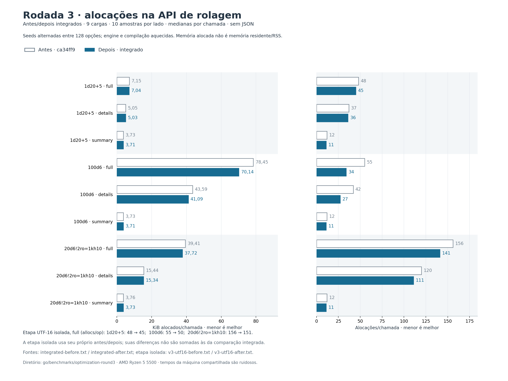
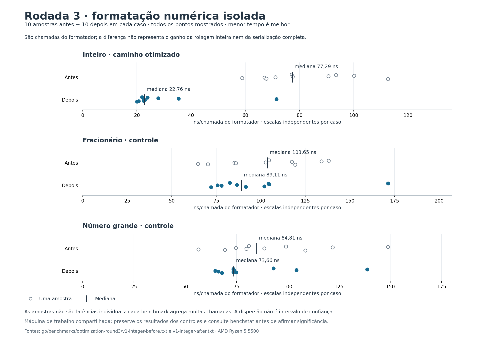
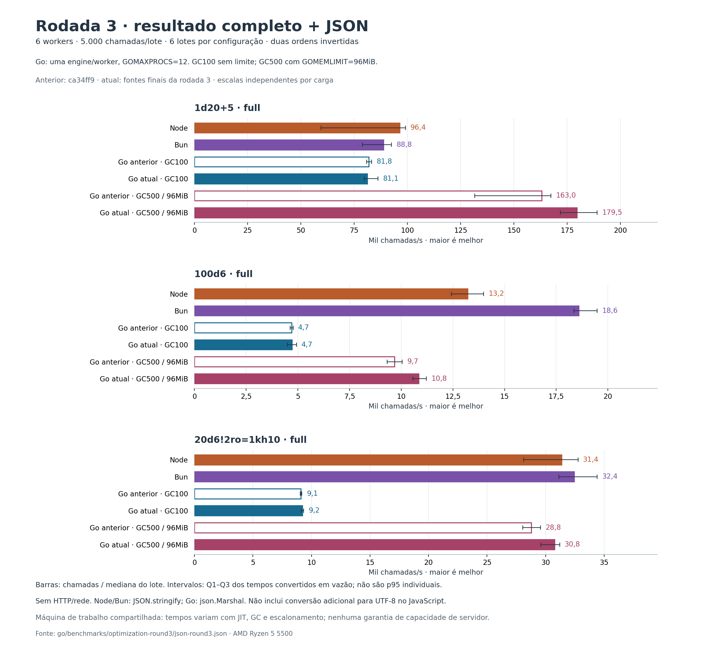

# Terceira rodada: otimização guiada por perfis e skills Go

A implementação integrada reduziu `100d6` completo de **55 para 34 alocações por
chamada (−38,18%)** e de **78,45 para 70,14 KiB alocados (−10,60%)**. As nove
cargas da API nativa reduziram alocações. As funções públicas, os resultados,
o JSON, as sementes, o replay, a ordem dos eventos e os erros continuam com o
mesmo contrato. Não há nova dependência de produção.



## Skills encontradas e aplicadas

Foram pesquisadas skills públicas para Go, profiling e benchmarks. Escolhemos
[golang-performance](https://github.com/samber/cc-skills-golang/blob/19a0626ae8565d27a7b7bdf59d8d99d94d7e284c/skills/golang-performance/SKILL.md)
e [golang-benchmark](https://github.com/samber/cc-skills-golang/blob/19a0626ae8565d27a7b7bdf59d8d99d94d7e284c/skills/golang-benchmark/SKILL.md),
versão 1.3.2, licença MIT, de `samber/cc-skills-golang`. Elas separam a seleção
de otimizações da metodologia de medição e incluem referências de CPU, memória,
JSON e comparação estatística. As pastas completas foram instaladas em
`~/.codex/skills` na revisão fixa `19a0626ae8565d27a7b7bdf59d8d99d94d7e284c`.

Aplicamos o ciclo perfil → hipótese → mudança isolada → comparação alternada
→ validação. A revisão arquitetural foi dividida entre memória, concorrência
e algoritmos/cache; as medições ocorreram sequencialmente. A skill local
`benchmark-optimization-loop` delimitou o orçamento em
[PLAN.md](benchmarks/optimization-round3/PLAN.md).

Estimativas genéricas de velocidade presentes nas skills não são evidência
desta biblioteca. A interpretação foi conferida com a documentação primária
de [diagnósticos Go](https://go.dev/doc/diagnostics),
[benchstat](https://pkg.go.dev/golang.org/x/perf/cmd/benchstat) e
[encoding/json](https://pkg.go.dev/encoding/json).
`benchstat` foi instalado somente como ferramenta de desenvolvimento, em
`golang.org/x/perf@v0.0.0-20260908200009-22c9c6c9d4da`.

## O que o perfil mostrou

Na codificação isolada de `100d6`, `encoding/json.appendCompact` apareceu com
**46,08% do CPU amostrado cumulativo**. A biblioteca padrão valida e copia o
JSON devolvido por `MarshalJSON`; incluir novos encoders personalizados sem
medir pode aumentar esse trabalho. A formatação geral de floats também apareceu
no perfil. [CPU antes](benchmarks/optimization-round3/profile-before-cpu.txt).

Na API nativa, as conversões `syntaxUnits`/UTF-16 representaram **4,81% dos bytes
alocados cumulativos**. Parte delas construía vetores apenas para contar o
comprimento. Os índices privados de dados cresciam por etapas, e a apresentação
criava um vetor de strings antes de juntá-las.
[Alocações antes](benchmarks/optimization-round3/profile-native-before.txt).

Os maiores arrays do executor também contêm dados e eventos que pertencem ao
resultado público. Seus percentuais no perfil não significam desperdício
integral. Reutilizar esse armazenamento entre chamadas quebraria o isolamento
dos resultados mutáveis; esta rodada elimina temporários e preserva a propriedade
dos dados.

## Hipóteses e decisões

| Variante | Mudança | Resultado e decisão |
|---|---|---|
| V1 | Formatar inteiros exatos diretamente | Aceita. O formatador de inteiros caiu de 77,29 para 22,76 ns na mediana (−70,55%, p<0,001, n=10). Frações, números grandes, `-0` e valores não finitos preservam o caminho e o contrato anteriores. O ganho não equivale ao ganho do JSON completo. |
| V2 | Receiver ponteiro no helper de eventos | Descartada. Nenhuma diferença de tempo ou alocação foi demonstrada nas três cargas JSON; todas as comparações de tempo tiveram p≥0,315. |
| V3 | Contar UTF-16 sem construir vetores | Aceita. `100d6` full: 55→50 alocações e −4,80% de bytes; mesma contagem para Unicode e UTF-8 inválido. |
| V4 inicial | Reservar índices privados para todos os tamanhos | Reduziu alocações grandes, mas a medição apontou +17,11% no tempo de d20 full (p=0,035). A variante foi refinada; o resultado inicial permanece registrado. |
| V4b | Reservar somente quando há mais de um dado | Aceita pela redução de alocações. Reserva limitada a 256 e aos orçamentos restantes, com arrays independentes por índice. `100d6` full: 50→36 alocações contra V1+V3. A piora de d20 não reapareceu como diferença significativa (p=0,912). |
| V5 | Montar o texto diretamente em `strings.Builder` | Aceita. Contra V1+V3, `100d6` full: 50→48 alocações e −2,76% de bytes. Mantém o formatador de números e a ordem de apresentação. |

V4b e V5 foram desenvolvidas em worktrees distintos a partir de V1+V3; seus
percentuais não são somados. A confirmação abaixo mede as quatro mudanças
aceitas juntas contra `ca34ff9`.



## Confirmação integrada

Go 1.26.2, Windows/amd64, Ryzen 5 5500, `GOMAXPROCS=1`, `GOGC=100`, sem limite
de memória. Dez amostras por lado, alternando a ordem antes/depois em cada par;
cada processo usa `-test.benchtime=100ms -test.count=1 -test.benchmem`.
As engines e compilações são aquecidas e as sementes alternam entre 128 opções.
Perfis e instrumentação de cobertura/race ficam fora destas medições.

| Carga | Alocações antes → depois | KiB/chamada antes → depois |
|---|---:|---:|
| `1d20+5` full | 48 → 45 | 7,147 → 7,038 |
| `1d20+5` details | 37 → 36 | 5,046 → 5,030 |
| `1d20+5` summary | 12 → 11 | 3,726 → 3,711 |
| `100d6` full | 55 → 34 | 78,45 → 70,14 |
| `100d6` details | 42 → 27 | 43,59 → 41,09 |
| `100d6` summary | 12 → 11 | 3,726 → 3,711 |
| `20d6!2ro=1kh10` full | 156 → 141 | 39,41 → 37,72 |
| `20d6!2ro=1kh10` details | 120 → 111 | 15,44 → 15,34 |
| `20d6!2ro=1kh10` summary | 12 → 11 | 3,758 → 3,727 |

Essas reduções tiveram p<0,001. A mediana de tempo de d20 full caiu 9,22%
(9,517→8,639 µs, p=0,019). Os demais tempos não demonstraram diferença
significativa a 5%; não afirmamos uma aceleração geral a partir deles.
São comparações exploratórias por linha, sem correção por testes múltiplos.
A conclusão mais sólida desta rodada é a redução de alocações e bytes.

A máquina também executava outros programas. A primeira série JSON teve alta
dispersão e foi mantida como diagnóstico; as decisões usam as séries alternadas.
Não comparamos causalmente os tempos atuais com os números de outra sessão.
Os dados completos, inclusive controles sem ganho e regressões iniciais, estão
nos [resultados do benchstat](benchmarks/optimization-round3/integrated-benchstat.txt)
e nos arquivos por variante do mesmo diretório.

## Comparação com Node e Bun

A [comparação com JSON](JSON_ROUND3_BENCHMARK.md) mede baseline e implementação
atual nesta mesma sessão, além de Node e Bun. Usa seis workers, 5.000 chamadas
por lote e seis lotes por configuração, em duas rodadas de ordem inversa.
Publica tanto GC padrão quanto `GOGC=500`/`GOMEMLIMIT=96MiB`, sem nova seleção
desses parâmetros. As conclusões da segunda rodada permanecem históricas.

| Full + JSON, seis workers | Go anterior configurado, chamadas/s | Go atual configurado, chamadas/s | Variação da mediana |
|---|---:|---:|---:|
| `1d20+5` | 163.009 | 179.525 | +10,13% |
| `100d6` | 9.676 | 10.841 | +12,04% |
| `20d6!2ro=1kh10` | 28.776 | 30.778 | +6,96% |

São variações observadas entre medianas de seis lotes; não representam uma
garantia de ganho universal. Com GC padrão, as medianas atual/anterior ficaram
entre 0,99× e 1,01×. Go configurado continuou à frente dos dois runtimes
JavaScript em **uma das três cargas JSON**, e Go padrão em zero.
Em `100d6`, Node fez 13.221 chamadas/s e Bun 18.595; no pool modificado, 31.363 e
32.441. A redução de temporários ainda não eliminou o gargalo de serialização.
Menos bytes alocados por chamada também não garante RSS menor: os snapshots
do Go padrão subiram nas duas cargas maiores, enquanto os configurados caíram.



## Verificação e reprodução

A suíte integrada mede **4.551/4.551 statements Go (100%)**, sem exclusões de
produção. Os seis geradores TypeScript passaram em `--check`, incluindo 12.680
casos matemáticos exatos. Novos testes verificam fronteiras numéricas, UTF-16,
UTF-8 inválido, limites, explosões, índices independentes, grupos, replay e
mutações de resultados. [Checagens do oráculo](benchmarks/optimization-round3/oracle-checks.txt).

O detector de condições de corrida passou junto da cobertura completa em
40,615 s. `go vet`, formatação e lint passaram. O fuzzing UTF-16 verificou
44.986 entradas sem divergência, além das sementes da suíte normal. A
compilação de testes para Linux/amd64 passou; não foi execução em Linux.
[Cobertura exata](benchmarks/optimization-round3/final-coverage.txt) ·
[Race detector](benchmarks/optimization-round3/final-race.txt) ·
[Fuzzing](benchmarks/optimization-round3/fuzz-utf16.txt).

A [auditoria final](benchmarks/optimization-round3/verification.json) confirma
os hashes dos 146 arquivos do snapshot de código, a cobertura exata, o arquivo
de paridade JSON e os 14 registros de fontes e gráficos do manifesto.

Com Go, Node e Bun disponíveis, a partir da raiz do repositório:

```powershell
# Em checkout isolado do commit ca34ff9, compilar o binário de testes baseline.
go -C /caminho/checkout-baseline/go test -c -o /caminho/baseline.exe
go -C go test -c -o /caminho/atual.exe
node scripts/compare-go-round3-micro.mjs /caminho/baseline.exe /caminho/atual.exe integrated '^BenchmarkBackendOperation$/(1d20.5|100d6|20d6.2ro=1kh10)$/(full|details|summary)$/changing=true$'
benchstat go/benchmarks/optimization-round3/integrated-before.txt go/benchmarks/optimization-round3/integrated-after.txt
node scripts/compare-json-round3.mjs --go go --baseline /caminho/baseline.exe --bun bun
python scripts/plot-go-round3.py
```

Os comandos exatos desta execução, ambientes, duração e hashes dos binários
estão nos arquivos JSON por variante. O script de gráficos valida os dados e
registra as fontes em seu manifesto. Os worktrees usados para as variantes
ficam em `.artifacts/optimization-round3`, sem alterar outras branches.
Para repetir a comparação atômica V1, copie somente `event_bench_test.go` para
o checkout baseline antes de compilar: esse benchmark novo não existia em
`ca34ff9`. A figura do formatador e as comparações isoladas de UTF-16 usam as
séries preservadas; executar apenas a confirmação integrada não as recria.
O renderer requer matplotlib; nesta máquina foi reutilizado o ambiente
`.artifacts/python-plot-deps` em `PYTHONPATH`, sem nova instalação.

## Pontos identificados para investigação posterior

- Misses de compilação retêm o mutex da engine durante trabalho caro. Mover
  esse trabalho exigiria preservar estatísticas, LRU e `ClearCache`; não há
  perfil de contenção que justifique promovê-lo nesta rodada.
- A heurística do cache RNG pode disputar lock com sementes únicas em engine
  compartilhada. A engine por worker já evita esse cenário; `TryLock` pode
  perder promoções e precisa de medição própria.
- A seleção já desempata pelo índice e pode dispensar ordenação estável;
  as ordenações de apresentação precisam manter a estabilidade. Falta medir
  uma carga dedicada antes de mudar o algoritmo.
- Templates privados dos grupos podem poupar trabalho em inputs com comentários
  diferentes e mesma fórmula. Isso não beneficia o benchmark de cache aquecido
  e exige preservar as cópias dos metadados públicos.

Esses são candidatos identificados, não ganhos já obtidos. O orçamento desta
rodada foi encerrado após as cinco hipóteses e a confirmação das quatro aceitas.
