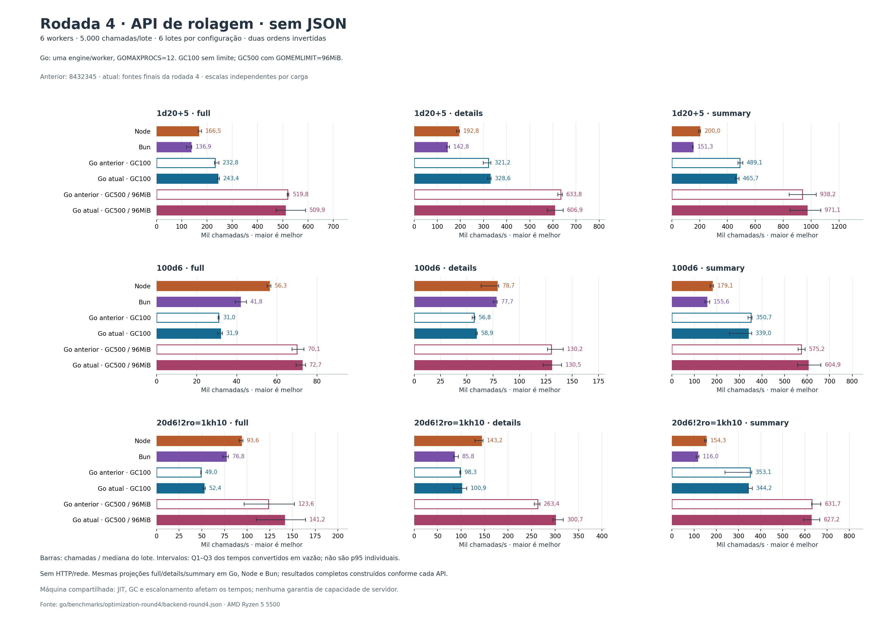
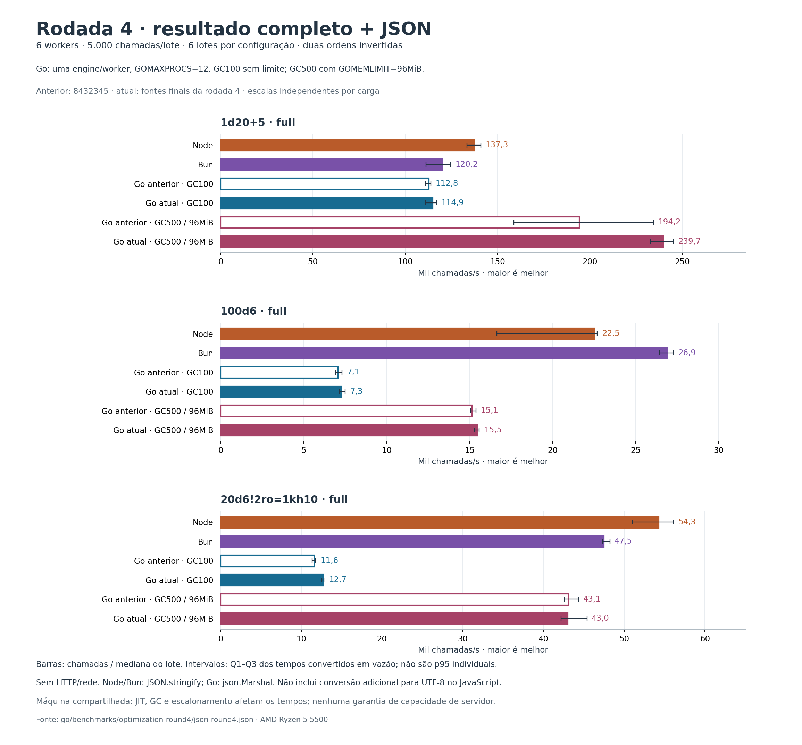
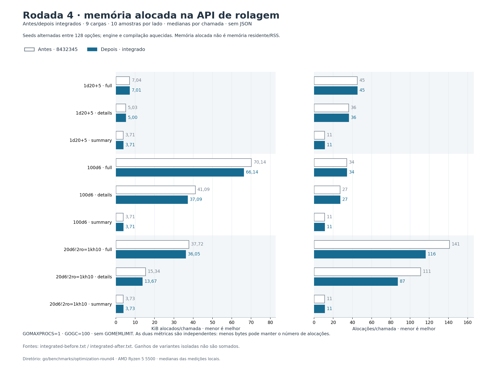

# Rodada 4: novos benchmarks e otimizações internas

A API nativa Go teve maior vazão que Node e Bun em **9/9 cargas com GC
configurado** e **5/9 com GC padrão**, nas medianas desta execução. Incluindo
JSON, foram **1/3 com GC configurado** e **0/3 com GC padrão**. São experimentos
separados; a vantagem da rolagem nativa ainda não se estende aos resultados JSON
maiores. As tabelas completas incluem as configurações vencedoras e perdedoras.

Contra a versão anterior, `8432345`, o pool com modificadores reduziu de
**141 para 116 alocações no resultado completo (−17,73%)** e de **111 para 87
no detalhado (−21,62%)**. `100d6` aloca **4 KiB a menos por chamada** nos dois
modos. A API, os tipos públicos, os resultados, o replay e o RNG permanecem iguais.

## API nativa: Node, Bun e Go

Medianas de vazão em chamadas/s, resultado completo, seis workers, uma engine
por worker. Go configurado usa `GOGC=500` e `GOMEMLIMIT=96MiB`; Go padrão usa
`GOGC=100` sem limite de memória configurado. Todos os processos Go usam
`GOMAXPROCS=12`. A biblioteca não altera essas variáveis.

| Expressão | Node | Bun | Go padrão | Go configurado |
|---|---:|---:|---:|---:|
| `1d20+5` | 166.525 | 136.881 | 243.360 | **509.900** |
| `100d6` | 56.298 | 41.759 | 31.939 | **72.653** |
| `20d6!2ro=1kh10` | 93.586 | 76.754 | 52.410 | **141.170** |

O Go configurado foi de **1,29× a 4,86×** a vazão do Node e de **1,68× a
6,42×** a do Bun nas nove cargas. Esses intervalos incluem full, details e
summary. Frente ao Go anterior, as medianas do pool configurado cresceram
**14,23% no completo** e **14,16% no detalhado**; outras cargas variaram para
cima ou para baixo. Por exemplo, `1d20+5` details configurado caiu 4,25%.



O [relatório da API nativa](BACKEND_ROUND4_BENCHMARK.md) apresenta as nove cargas,
as seis configurações, os quartis dos lotes e os snapshots de RSS.

## Rolagem completa seguida por JSON

Aqui a medição inclui `JSON.stringify` em JavaScript e `encoding/json.Marshal`
em Go. As configurações de workers e GC são as mesmas da tabela anterior.

| Expressão | Node | Bun | Go padrão | Go configurado |
|---|---:|---:|---:|---:|
| `1d20+5` | 137.332 | 120.188 | 114.855 | **239.729** |
| `100d6` | 22.516 | **26.874** | 7.250 | 15.466 |
| `20d6!2ro=1kh10` | **54.260** | 47.485 | 12.723 | 43.004 |

O gargalo de serialização permanece. A maior vantagem observada nesta série
foi `1d20+5` configurado: +23,43% sobre o Go anterior, cuja dispersão foi maior.
`100d6` configurado variou +2,17%, e o pool configurado −0,18%. No GC padrão,
o pool cresceu 9,53%. São variações entre medianas de seis lotes, sem um teste
de significância para essas razões; não são garantias de capacidade.



O [relatório JSON](JSON_ROUND4_BENCHMARK.md) inclui tempos, quartis, tamanho
emitido, RSS e comparação direta com os binários anteriores. Menos bytes
alocados por operação não implica RSS menor: no JSON `100d6` com GC padrão,
a mediana dos snapshots subiu de 16,41 para 34,56 MiB. RSS inclui runtime,
harness, memória retida e as cargas anteriores do mesmo processo.

## Mudanças avaliadas e aplicadas

Aplicamos novamente `golang-performance` e `golang-benchmark` da revisão
`19a0626ae8565d27a7b7bdf59d8d99d94d7e284c` de
[samber/cc-skills-golang](https://github.com/samber/cc-skills-golang/tree/19a0626ae8565d27a7b7bdf59d8d99d94d7e284c),
com o orçamento descrito no [plano](benchmarks/optimization-round4/PLAN.md).
As revisões de memória, algoritmos e JSON ocorreram em paralelo; todas as
medições ocorreram sequencialmente, com código candidato em worktrees isolados.

O perfil atual de `100d6` atribuiu 22,42% dos bytes alocados a
`createWorkingDie` e 22,30% a `finalizeWorkingDice`. No pool, a finalização dos
dados representou 14,40% dos objetos alocados. Na codificação, `appendCompact`
foi 59,84% do CPU cumulativo amostrado e `ResolvedEvent.appendJSON`, 14,51%.
Esses perfis identificam custos; não são os tempos usados para provar ganhos.
[Memória nativa](benchmarks/optimization-round4/profile-native-alloc.txt) ·
[Objetos do pool](benchmarks/optimization-round4/profile-pool-objects.txt) ·
[CPU do JSON](benchmarks/optimization-round4/profile-json-cpu.txt).

| Hipótese | Implementação | Evidência isolada contra `8432345` |
|---|---|---|
| H1 — dado privado menor | `workingDie` passa de 152 para 120 bytes em amd64; mantém a identidade do AST e usa o spec existente para os lados. `ResolvedDie` público continua com 144 bytes. | `100d6`: −5,70% dos bytes em full e −9,73% em details, sem mudança no número de alocações. Tempos inconclusivos. |
| H2 — transferência dos estados | O resultado recebe os slices privados de estados após o último modificador, evitando uma cópia por entidade. | Pool: 141→121 alocações full e 111→92 details. Tempos inconclusivos. |
| H3 — seleção com um único vetor | Junta valor e índice original, usa armazenamento local até 32 ativos e dimensiona a reserva maior pela população ativa. | Pool: cinco alocações a menos em full/details. Mesma ordem de eventos, inclusive nos desempates. Tempos inconclusivos. |
| H4 — eventos comuns | Escreve trechos constantes dos envelopes de `die/roll` e `die/include`, usando os mesmos encoders para dados mutáveis. | Escrita isolada: −47,76% e −47,80% do tempo, p<0,001. O JSON completo isolado não mostrou diferença significativa. |

Todas passaram pelos testes e foram aceitas pela melhoria em seus alvos. As
porcentagens isoladas não são somadas. Os dados de cada hipótese e seus patches
estão no diretório desta rodada. O benchmark isolado de seleção está disponível
para investigação futura, mas não foi medido nesta rodada.

## Confirmação das quatro mudanças juntas

Go 1.26.2, Windows/amd64, Ryzen 5 5500, `GOMAXPROCS=1`, `GOGC=100`,
`GOMEMLIMIT=off`. Dez amostras por lado, com ordem antes/depois alternada em cada
par, 100 ms por caso/processo. A compilação e os perfis ficam fora do cronômetro.

| Carga | Alocações antes → depois | KiB/chamada antes → depois | Tempo mediano antes → depois |
|---|---:|---:|---:|
| `1d20+5` full | 45 → 45 | 7,038 → 7,007 | 7,008 → 7,106 µs |
| `1d20+5` details | 36 → 36 | 5,030 → 4,999 | 6,242 → 6,211 µs |
| `1d20+5` summary | 11 → 11 | 3,711 → 3,711 | 4,505 → 4,557 µs |
| `100d6` full | 34 → 34 | 70,14 → 66,14 | 25,54 → 25,07 µs |
| `100d6` details | 27 → 27 | 41,09 → 37,09 | 17,22 → 16,69 µs |
| `100d6` summary | 11 → 11 | 3,711 → 3,711 | 6,715 → 6,822 µs |
| `20d6!2ro=1kh10` full | 141 → 116 | 37,72 → 36,05 | 17,95 → 17,05 µs |
| `20d6!2ro=1kh10` details | 111 → 87 | 15,34 → 13,67 | 14,65 → 12,30 µs |
| `20d6!2ro=1kh10` summary | 11 → 11 | 3,727 → 3,727 | 7,022 → 7,006 µs |

Os tempos do pool caíram **5,04% em full (p=0,005)** e **16,06% em details
(p<0,001)**. `100d6` summary teve uma pequena piora de **1,59% (p=0,022)**,
mesmo sem alteração no caminho de execução usado por esse caso. Essa piora
permanece registrada; não afirmamos aceleração em todas as cargas. Os demais
tempos não diferiram significativamente a 5%. Todas as reduções de bytes e
alocações tiveram p<0,001. Comparações exploratórias por linha, sem correção
para múltiplos testes. [Benchstat integral](benchmarks/optimization-round4/integrated-benchstat.txt).



## Validação, limites e reprodução

- **4.585/4.585 statements de produção cobertos (100%)**, sem exclusões.
- Detector de corridas aprovado junto com a suíte de cobertura em 27,264 s.
- Seis geradores TypeScript aprovados em `--check`, incluindo 12.680 casos
  matemáticos exatos; fixtures preservadas.
- Testes novos comparam seleção com a implementação anterior, inclusive limites
  32/33, empates, frações, inativos, seleções sucessivas e falhas de orçamento.
- Testes de estados/metadados verificam mutações entre entidades, projeções,
  chamadas e replay. Testes de JSON cobrem bytes, campos, escapes, `-0`, valores
  não finitos, fallback legado e marshalers personalizados.
- `go vet`, formatação e lint dos três scripts JavaScript novos aprovados;
  testes compilados para Linux/amd64, sem execução em Linux.

[Cobertura exata](benchmarks/optimization-round4/final-coverage.txt) ·
[Perfil de cobertura](benchmarks/optimization-round4/final-coverage.out) ·
[Race detector](benchmarks/optimization-round4/final-race.txt) ·
[Oráculos TypeScript](benchmarks/optimization-round4/oracle-checks.txt).

A [auditoria final](benchmarks/optimization-round4/verification.json) confirmou
os hashes dos 151 arquivos de cada confronto, o mesmo binário final nos testes
nativo e JSON, os dois arquivos de paridade, a cobertura exata e os 14 registros
de fontes/gráficos do manifesto. Os três PNG foram inspecionados visualmente.

Nos confrontos de runtimes, cada processo aquece 1.000 chamadas por worker e
mede três lotes de 5.000 chamadas. Duas ordens inversas geram seis lotes por
configuração. O preflight compara todos os campos de 54 resultados nativos e
18 resultados JSON por configuração, sem tolerância numérica. Os workers de
benchmark são os mesmos do baseline. Os manifestos registram versões, fontes,
binários, ambientes, duração, dados brutos e arquivos gzip do preflight.

Esses ensaios não incluem HTTP ou rede. No JSON, não incluem a conversão extra
da string JavaScript para bytes UTF-8. A máquina é compartilhada com outros
programas; não foi reservada exclusivamente para benchmarks. Quartis de lotes
não são p95 de chamadas individuais. Os números de outras sessões não foram
usados como baseline: `8432345` foi medido novamente junto dos candidatos.

Na raiz do repositório, com Go, Node, Bun, dist TypeScript e matplotlib disponíveis:

```powershell
# Em um checkout isolado de 8432345:
go -C /caminho/baseline/go test -c -o /caminho/baseline.exe
go -C go test -c -o /caminho/atual.exe
node scripts/compare-go-round4-micro.mjs /caminho/baseline.exe /caminho/atual.exe integrated '^BenchmarkBackendOperation$/(1d20.5|100d6|20d6.2ro=1kh10)$/(full|details|summary)$/changing=true$'
benchstat go/benchmarks/optimization-round4/integrated-before.txt go/benchmarks/optimization-round4/integrated-after.txt
node scripts/compare-backend-round4.mjs --go go --baseline /caminho/baseline.exe --bun bun
node scripts/compare-json-round4.mjs --go go --baseline /caminho/baseline.exe --bun bun
python scripts/plot-go-round4.py
```

Para repetir H4, copie o benchmark `BenchmarkEventEnvelope` e seus imports/sink
necessários para o checkout baseline antes de compilar; ele não existia em
`8432345`. As quatro hipóteses usam essa revisão como base, e a confirmação
mede as quatro juntas. Os gráficos leem os dados salvos e possuem manifesto
de hashes; não exigem nova medição para serem renderizados.
