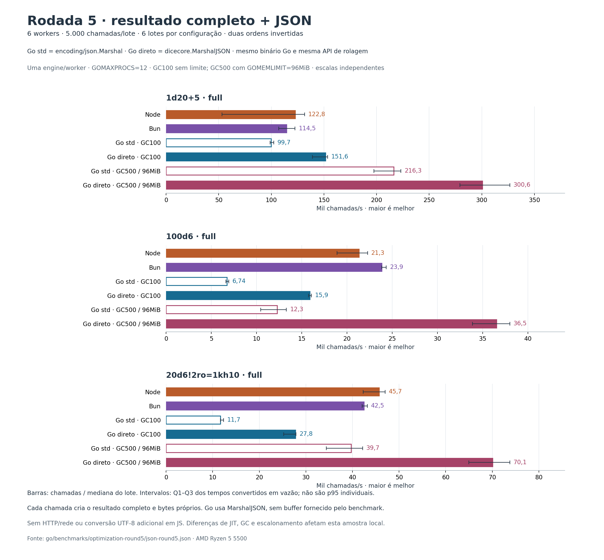
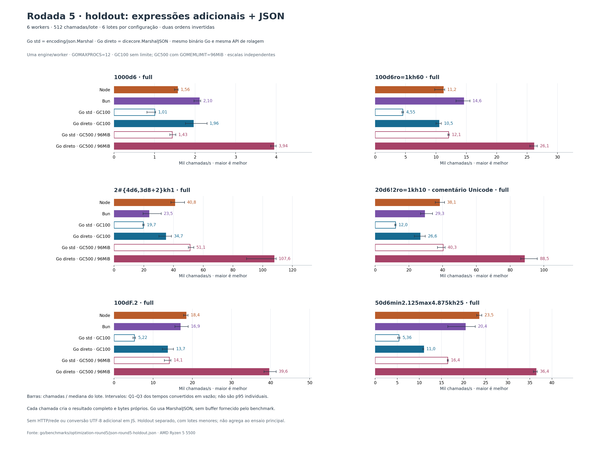
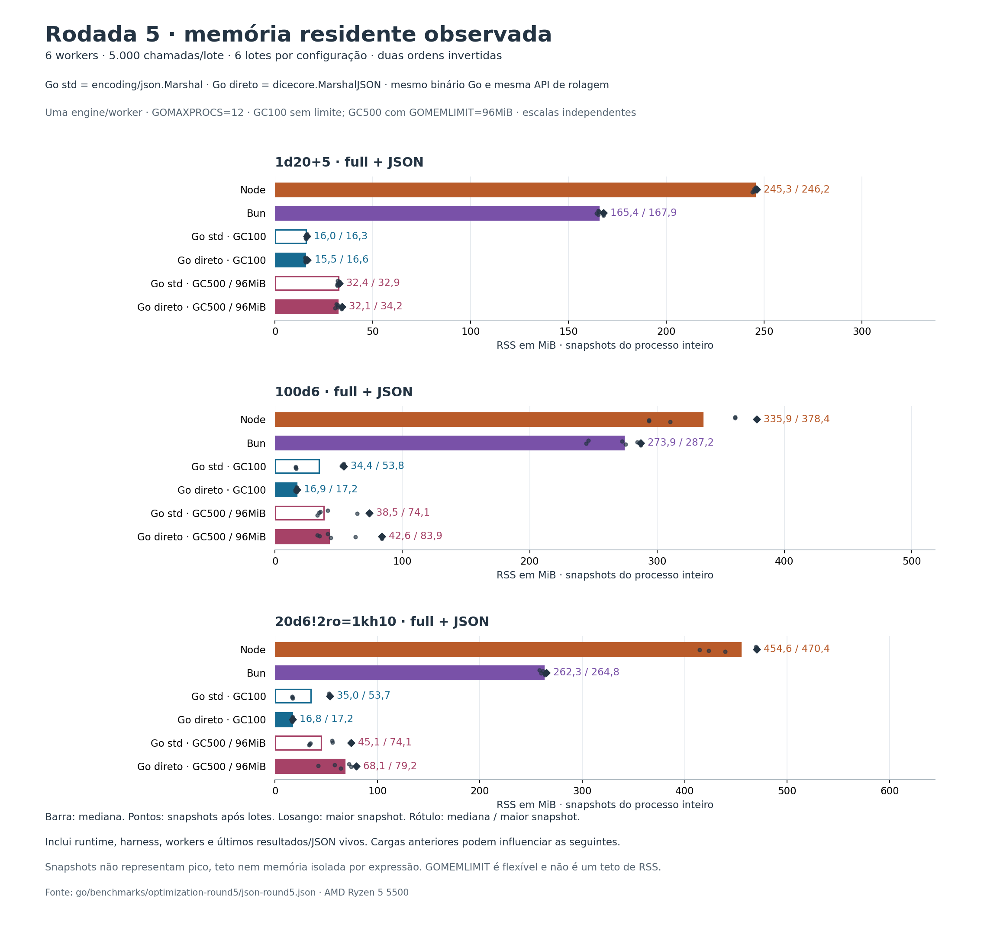
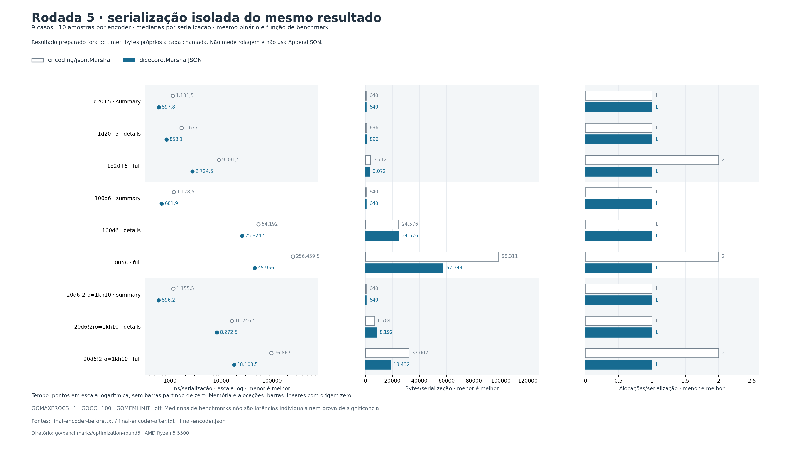

# Rodada 5 — serialização direta para o backend

Em 14/09/2026, Go com **`dicecore.MarshalJSON`, `GOGC=500` e `GOMEMLIMIT=96MiB`** superou as medianas de Node e Bun nas **3/3 cargas principais** e nas **6/6 expressões adicionais**. Com o GC padrão, o encoder direto venceu **1/3** e **0/6**, respectivamente. São resultados locais de rolagem seguida por JSON, sem HTTP.

A API de rolagem, os tipos e os resultados continuam iguais. Para obter estes ganhos, **o chamador precisa usar `dicecore.MarshalJSON` ou `dicecore.AppendJSON`**. Continuar chamando `encoding/json.Marshal` mantém o caminho anterior. A melhoria não adiciona dependências de produção, `unsafe`, experimentos de toolchain ou alterações globais de GC na biblioteca.

## Mudança e contrato

O [perfil anterior](benchmarks/optimization-round5/profile-baseline-cpu.txt) atribuiu 61,73% do tempo acumulado a `encoding/json.appendCompact`. O novo encoder escreve diretamente as projeções full, details e summary, evitando a revalidação de JSON nesse caminho. Ele lê os campos atuais, incluindo alterações feitas pelo chamador, sem cache de resultados nem nova rolagem.

A saída preserva os bytes de `encoding/json.Marshal`, incluindo ordem, escapes, números, `null` e coleções vazias. Outros tipos e resultados com `Sides` personalizados ou eventos legados seguem integralmente pela biblioteca padrão, preservando callbacks e erros. Os bytes pertencem ao chamador; não há pool privado de buffers retornados. Mutação simultânea durante a serialização continua exigindo sincronização.

## Comparação principal

AMD Ryzen 5 5500, Windows 11 Pro, 12 CPUs lógicas; Go 1.26.2, Node 24.18.0 e Bun 1.4.0. Todos usam seis workers e uma engine por worker; Go usa `GOMAXPROCS=12`. São seis amostras por configuração/carga: três lotes de 5.000 chamadas em cada uma de duas execuções, com ordem invertida. Aquecimento, inicialização e compilação ficam fora do tempo.

As séries Go std/direct usam o **mesmo binário final**. O commit-base `cecb59b` serve como controle adicional de paridade, sem série de tempo própria. Seeds, resultados completos e trabalho de rolagem coincidem entre runtimes. O benchmark mede `MarshalJSON` com bytes novos; não usa `AppendJSON` nem reaproveitamento de buffer. JavaScript usa `JSON.stringify`, sem conversão adicional para Buffer UTF-8.

Valores em **rolagens completas com JSON por segundo**, calculados pela mediana dos lotes e arredondados. “Go padrão” e “Go configurado” abaixo usam o encoder direto; configurado significa GC500/96MiB. Razões maiores que 1 favorecem Go.

| Expressão | Node | Bun | Go padrão | Go configurado | Go conf./Node | Go conf./Bun |
|---|---:|---:|---:|---:|---:|---:|
| `1d20+5` | 122.809 | 114.513 | 151.641 | 300.633 | 2,45× | 2,63× |
| `100d6` | 21.331 | 23.850 | 15.891 | 36.524 | 1,71× | 1,53× |
| `20d6!2ro=1kh10` | 45.727 | 42.467 | 27.767 | 70.085 | 1,53× | 1,65× |

O gráfico preserva as seis séries, incluindo os dois controles `encoding/json.Marshal`. As linhas mostram Q1–Q3; as vitórias contam medianas, sem constituir teste de significância. [Método e valores completos](JSON_ROUND5_BENCHMARK.md).



## Expressões adicionais

O holdout inclui volume maior, reroll, seleção, grupos, Unicode, Fudge e frações. Usa seis amostras de 512 chamadas, com aquecimento menor. É um ensaio separado: suas taxas não são agregadas às do principal.

| Expressão | Node | Bun | Go padrão | Go configurado | Go conf./Node | Go conf./Bun |
|---|---:|---:|---:|---:|---:|---:|
| `1000d6` | 1.565 | 2.105 | 1.956 | 3.941 | 2,52× | 1,87× |
| `100d6ro=1kh60` | 11.216 | 14.572 | 10.481 | 26.119 | 2,33× | 1,79× |
| `2#{4d6,3d8+2}kh1` | 40.790 | 23.463 | 34.732 | 107.570 | 2,64× | 4,58× |
| `20d6!2ro=1kh10 # ação 🎲` | 38.115 | 29.293 | 26.616 | 88.496 | 2,32× | 3,02× |
| `100dF.2` | 18.415 | 16.898 | 13.668 | 39.585 | 2,15× | 2,34× |
| `50d6min2.125max4.875kh25` | 23.459 | 20.380 | 10.955 | 36.389 | 1,55× | 1,79× |

[Dados e verificações do holdout](JSON_ROUND5_HOLDOUT.md). Em Unicode, comprimento UTF-16 no JavaScript e bytes UTF-8 no Go podem diferir; a comparação exige igualdade dos valores completos.



## Memória e custo de serialização

RSS do ensaio principal, em **MiB, mediana/máximo das amostras coletadas**:

| Expressão | Node | Bun | Go direto padrão | Go direto configurado |
|---|---:|---:|---:|---:|
| `1d20+5` | 245,33/246,21 | 165,41/167,90 | 15,53/16,65 | 32,13/34,18 |
| `100d6` | 335,85/378,36 | 273,92/287,21 | 16,89/17,20 | 42,56/83,95 |
| `20d6!2ro=1kh10` | 454,57/470,39 | 262,32/264,81 | 16,80/17,22 | 68,14/79,21 |

**Essas amostras não medem o pico real.** Incluem o processo, runtime, harness e memória retida entre cargas. A configuração aumenta o RSS observado frente ao Go padrão em troca de vazão. `GOMEMLIMIT=96MiB` é um limite flexível de memória administrada pelo runtime, não um teto de RSS.



A confirmação isolada serializa resultados já construídos: dez pares alternados, GOMAXPROCS=1, GC padrão e mesmo binário. Nas projeções full:

| Resultado | Tempo std → direto | Redução do tempo | Redução B/op | Alocações |
|---|---:|---:|---:|---:|
| d20 | 9,082 → 2,724 µs | 70,00% | 17,24% | 2 → 1 |
| 100d6 | 256,46 → 45,96 µs | 82,08% | 41,67% | 2 → 1 |
| pool | 96,87 → 18,10 µs | 81,31% | 42,40% | 2 → 1 |

O tempo caiu nas nove projeções, mas **pool/details aloca 20,75% mais bytes** que std: 6.784 → 8.192 B/op. Esses percentuais medem somente serialização, não a chamada inteira.



O [registro das três hipóteses](benchmarks/optimization-round5/LEDGER.md) preserva tentativas e hashes. H2 foi rejeitada por elevar d20/full de uma para duas alocações e aumentar B/op em 75%. H3 corrigiu essa reserva e reduziu memória frente ao primeiro encoder, aceitando regressões medidas de tempo em d20/full (+29,95%) e pool/details (+19,56%). A confirmação acima compara o estado final com std; ganhos de experimentos distintos não são somados.

## Validação e adoção

A suíte final cobre **4.802/4.802 statements: 100%**, sem exclusões; o detector de condições de corrida passou em **28,887 s**. Os testes diferenciais verificam 554 projeções bem-sucedidas, por valor e ponteiro, com igualdade integral de bytes frente à biblioteca padrão. Os seis geradores de fixtures TypeScript passaram com `--check`. Foram exercitados mutações, erros, callbacks, ciclos, nil, Unicode e números extremos. O fuzzing executou **13.183 casos no encoder inicial**; as 20 seeds incluídas no repositório passaram na suíte final. A [validação completa](benchmarks/optimization-round5/VALIDATION.md) documenta os comandos e limites dessas verificações, sem provar ausência de todo defeito.

Após a rolagem existente, a alteração no consumidor é explícita:

```go
// result é o resultado full, details ou summary já obtido da engine.
payload, err := dicecore.MarshalJSON(result)
if err != nil {
    return err
}
_, err = writer.Write(payload)
return err
```

`AppendJSON(dst, result)` permite reutilizar capacidade pertencente ao chamador. Em erro, devolve `dst` com comprimento e prefixo originais; a região além do comprimento pode ter sido usada como temporário. Aguarde o consumidor terminar antes de reutilizar o buffer. Esse recurso não foi usado nos números publicados.

Para reproduzir a configuração medida, defina `GOGC=500`, `GOMEMLIMIT=96MiB` e `GOMAXPROCS=12` no **processo**. Ao integrar ao servidor, ajuste o orçamento considerando seus demais componentes e valide tráfego, concorrência, latência e memória reais. Estes ensaios não medem capacidade HTTP ou implantação.

As [skills fixadas e fontes primárias](OPTIMIZATION_ROUND3.md#skills-encontradas-e-aplicadas) orientaram perfil, hipótese e medição. Os [dados verificados](benchmarks/optimization-round5/verification.json), o [manifesto dos gráficos](benchmarks/optimization-round5/plot-round5-manifest.json), os SVG correspondentes e o registro de experimentos permitem auditar a conclusão.
