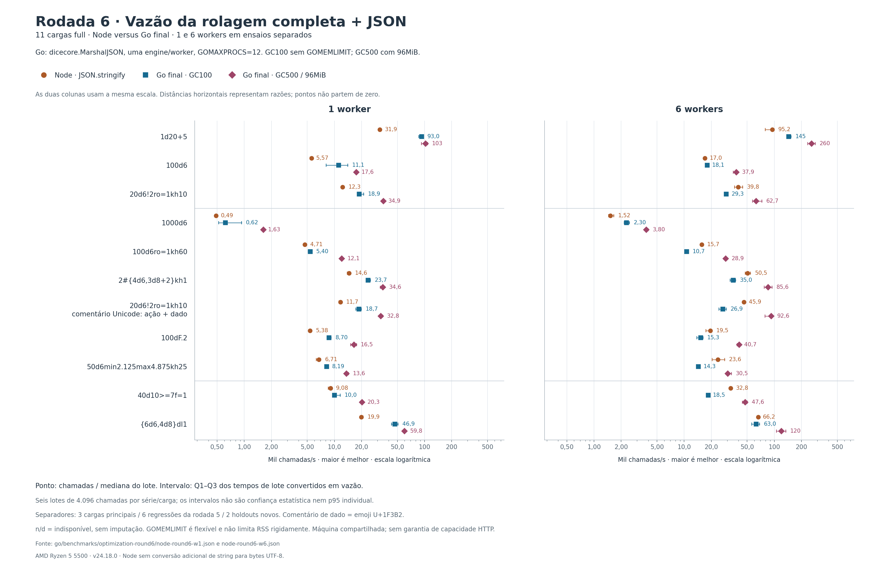
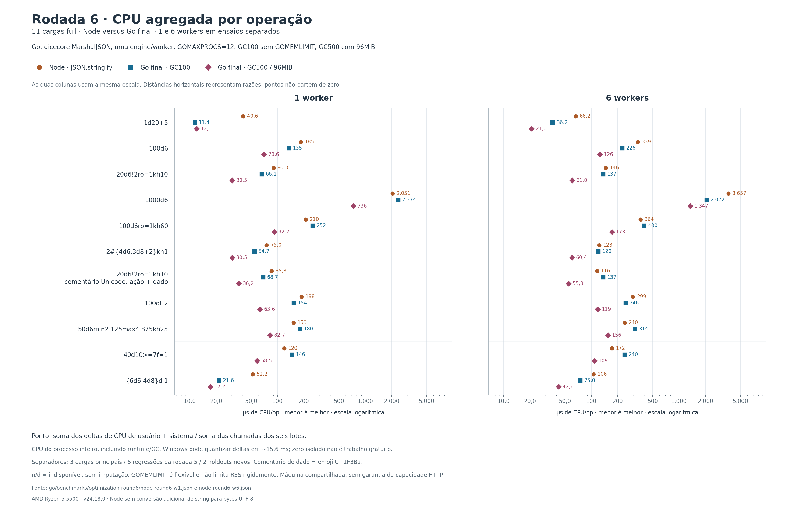
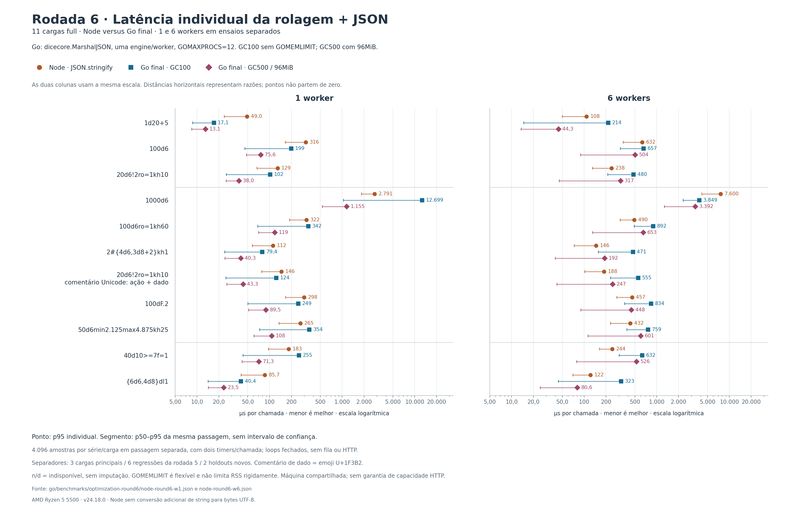
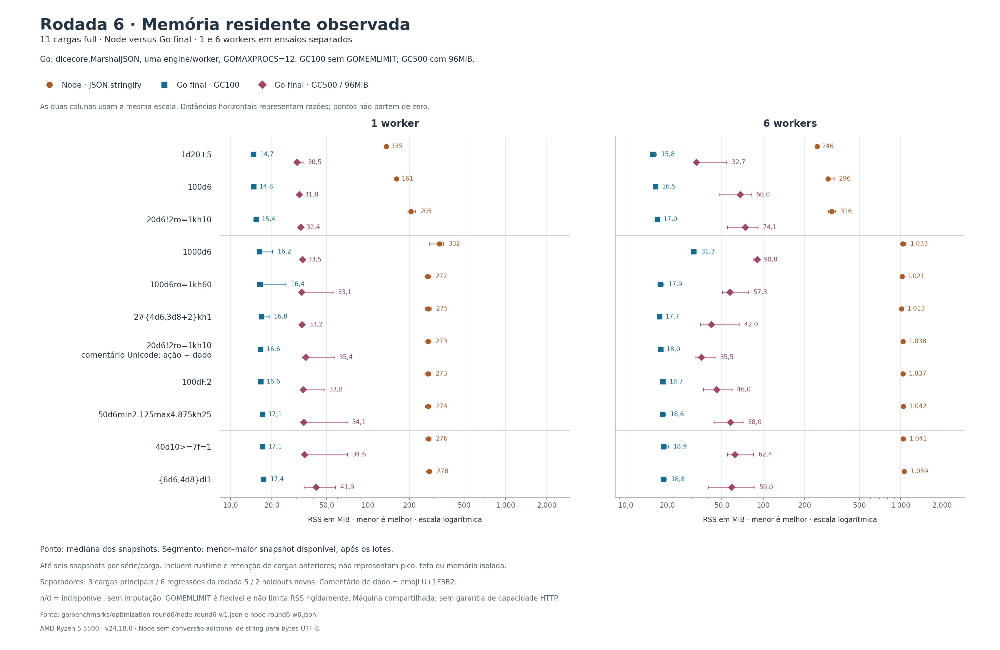

# Rodada 6: Go versus Node

O número anterior era **9 de 9 cargas**, em rolagem completa seguida de JSON,
com Go configurado. Eram nove expressões; não nove dimensões de desempenho.
Contra Node sozinho, Go com GC padrão havia vencido duas dessas nove cargas
na rodada 5. Esta rodada foca exclusivamente Node e amplia o ensaio para
**11 expressões**, com um e seis workers medidos separadamente.

## Mudanças aplicadas

A biblioteca mantém a API, os resultados e a propriedade dos dados retornados.
A escrita do JSON usa uma tabela privada para classificar bytes ASCII e escreve
as chaves fixas dos dados em um slice local, reduzindo chamadas genéricas e
atualizações do escritor. Os valores continuam sendo lidos do resultado atual;
Unicode, escapes, números e erros preservam os caminhos já validados.

Duas tentativas de reaproveitar dados temporários em arenas economizaram
memória por chamada, mas pioraram rolagens com modificadores. Foram rejeitadas.
O [registro das quatro hipóteses](benchmarks/optimization-round6/LEDGER.md)
inclui resultados, decisões, fontes exatas e hashes, inclusive das tentativas
que não entraram na biblioteca.

## Confirmação da serialização

Go anterior (`f107265`) e atual, dez pares alternados, GOMAXPROCS=1, GC100,
resultados já construídos e `dicecore.MarshalJSON` nas duas versões:

| Resultado full | Anterior | Atual | Redução de tempo |
|---|---:|---:|---:|
| d20 | 3,231 µs | 2,611 µs | 19,19% |
| 100d6 | 46,08 µs | 31,05 µs | 32,62% |
| pool com modificadores | 19,13 µs | 13,74 µs | 28,18% |

Em details, a redução foi de 51,22% em 100d6 e 41,55% no pool. Sete das nove
projeções tiveram redução significativa pelo benchstat; duas ficaram sem
diferença significativa. Todas mantiveram os mesmos bytes e uma alocação por
serialização. Os testes usam buffers próprios, sem reutilização pelo chamador.

[Benchstat completo](benchmarks/optimization-round6/final-json-benchstat.txt).
Esses percentuais medem a serialização isolada, não a chamada de rolagem inteira.
Os p-valores são por comparação, sem correção para múltiplos testes.

## Comparativo da chamada completa

Número de expressões em que Go atual teve valor melhor que Node, entre as
11 testadas. As colunas medem dimensões diferentes e não devem ser somadas:

| Workers | Perfil Go | Vazão maior | CPU/op menor | RSS menor | p50 menor | p95 menor |
|---:|---|---:|---:|---:|---:|---:|
| 1 | GC100 | 11/11 | 7/11 | 11/11 | 11/11 | 7/11 |
| 1 | GC500 / 96MiB | 11/11 | 11/11 | 11/11 | 11/11 | 11/11 |
| 6 | GC100 | 3/11 | 7/11 | 11/11 | 4/11 | 1/11 |
| 6 | GC500 / 96MiB | 11/11 | 11/11 | 11/11 | 11/11 | 5/11 |

Com seis workers e GC500/96MiB, Go entregou **1,29× a 2,73× a vazão do Node**,
com **35% a 68% menos CPU por chamada**. Os RSS medianos por expressão ficaram
entre **32,70 e 90,80 MiB em Go**, contra **245,86 a 1.058,89 MiB em Node**.
Essas faixas agrupam diferentes expressões e momentos; não são máximos reais
nem uma comparação pareada dos extremos.

Contudo, o p95 perdeu em seis expressões: pool, reroll/seleção, múltiplos grupos,
comentário Unicode, limites fracionários e pool de sucessos. Em `40d10>=7f=1`,
foram **525,575 µs em Go versus 244,050 µs em Node**, apesar do p50 menor em Go.
Esse perfil, portanto, ainda não venceu todas as dimensões com seis workers.
O [ensaio adicional de configuração](NODE_LATENCY_ROUND6.md) trata essa lacuna.

O comparativo anterior/atual usa a mesma sessão e o mesmo harness. Em GC100,
as vitórias em vazão passaram de 10 para 11 com um worker e de 2 para 3 com
seis. Em GC500/96MiB, ambos venceram as 11 em vazão. Os percentuais isolados
da serialização não se traduzem integralmente em ganho sob concorrência/GC.

Os ensaios terminaram em **327,714 s** (um worker) e **129,142 s** (seis),
com Node 24.18.0 e Go 1.26.2 em Windows/amd64, Ryzen 5 5500.









## Método e limites da conclusão

São chamadas full com cache aquecido, MT19937, seeds diferentes dentro de cada
lote e uma engine por worker. Node usa `worker_threads`; Go usa goroutines e
GOMAXPROCS=12. Os dois regimes Go são GC100 sem limite de memória herdado e
GC500 com GOMEMLIMIT=96MiB. A biblioteca não altera o GC global.

Cada expressão recebe três lotes de 4.096 chamadas em dois processos novos,
com ordem invertida na segunda passagem. Uma passagem separada mede 2.048
latências individuais por processo: 4.096 amostras por série/expressão. CPU/op
agrega os deltas de usuário e sistema de todo o processo, incluindo GC e
threads de runtime. RSS é amostrado depois dos lotes e inclui runtime, harness
e retenção de cargas anteriores; não é pico nem memória isolada por expressão.

Go usa `dicecore.MarshalJSON`, produzindo bytes UTF-8 próprios; Node usa
`JSON.stringify`, produzindo uma string, sem conversão adicional para bytes.
As saídas completas são comparadas antes da medição e todos os lotes verificam
contagens e digests. As nove expressões antigas são regressões; os dois casos
novos, `40d10>=7f=1` e `{6d6,4d8}dl1`, não orientaram a seleção das mudanças.

A comparação mede a biblioteca e sua serialização. Capacidade HTTP, filas,
rede, persistência, cache frio, entradas inválidas e chamadas sem seed exigem
medições próprias. Os percentis são de serviço em loops fechados, com
instrumentação por chamada. Contagens de vitórias representam valores
observados, sem teste de significância para o confronto entre runtimes.

O [ensaio com relógio de resolução insuficiente](benchmarks/optimization-round6/failed-coarse-clock/README.md)
foi arquivado e substituído por QPC no Windows. O
[ensaio que excedeu o orçamento inicial](benchmarks/optimization-round6/failed-wall-budget/README.md)
também foi arquivado; a confirmação foi repetida integralmente com teto de
540 segundos por invocação. Nenhuma amostra dessas tentativas incompletas
contribui para as tabelas ou gráficos finais.

## Validação e uso no backend

**4.817/4.817 statements cobertos: 100%**, sem exclusões. Testes de concorrência
com detector de races, vet, os seis geradores de referências TypeScript e
11.981 execuções de fuzzing passaram. Os testes novos incluem todos os valores
de byte, prefixos, objetos aninhados, estados mutáveis, números extremos e
precedência de erros. [Comandos e evidências](benchmarks/optimization-round6/VALIDATION.md).

O consumidor mantém a rolagem existente e escolhe explicitamente o encoder:

```go
result, err := engine.Roll(input, options)
if err != nil {
    return err
}
payload, err := dicecore.MarshalJSON(result)
if err != nil {
    return err
}
_, err = writer.Write(payload)
return err
```

O perfil configurado deste ensaio usa `GOGC=500`, `GOMEMLIMIT=96MiB` e
`GOMAXPROCS=12` no processo. O limite de memória é flexível, considera o runtime
inteiro e não limita rigidamente o RSS. Na integração ao servidor, dimensione
esse orçamento para os demais componentes do processo e valide a carga real.
`AppendJSON` permite reutilização de um buffer pertencente ao chamador quando
o consumidor terminou de usá-lo; esse recurso não foi usado no comparativo.

Os [ensaios de um worker](NODE_ROUND6_W1.md) e
[seis workers](NODE_ROUND6_W6.md) contêm todas as séries anteriores/atuais,
dispersão e comandos. Os dados, SVGs, manifestos e o
[verificador offline](../scripts/verify-node-round6.mjs) permitem auditar as
conclusões. A metodologia segue as
[skills e fontes fixadas na rodada 3](OPTIMIZATION_ROUND3.md#skills-encontradas-e-aplicadas).
