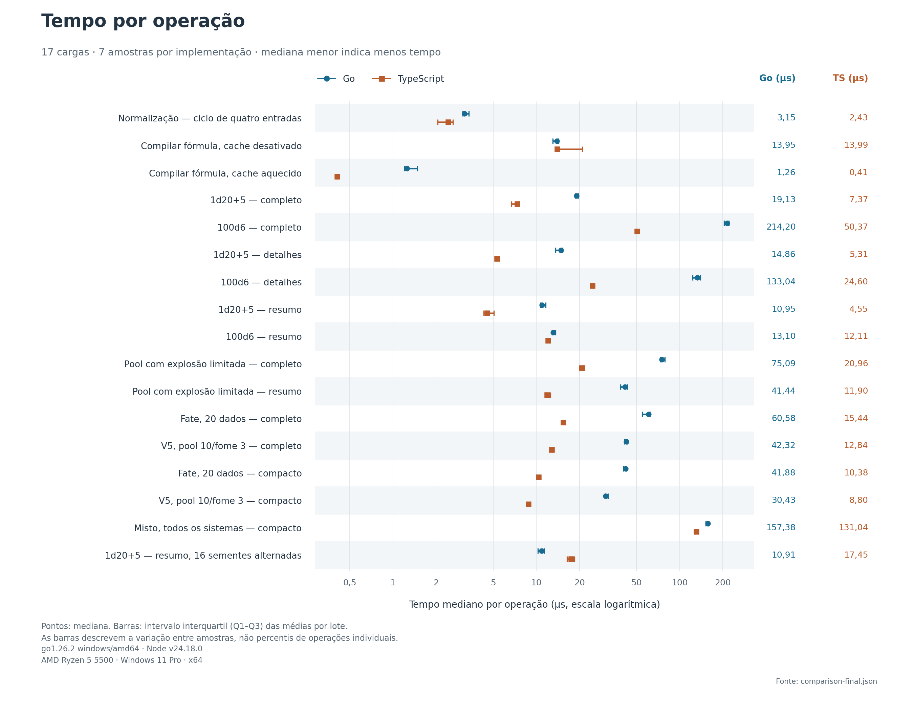
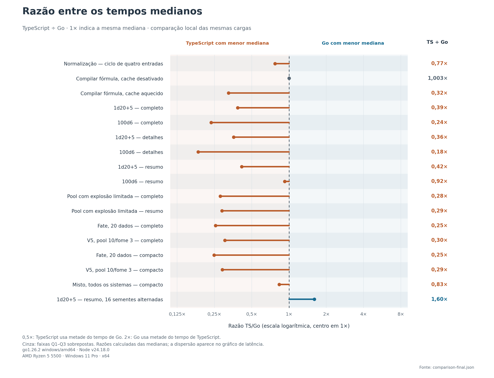

# Baseline antes das otimizações

Arquivos preservados, byte a byte, do commit `62de502`. O [manifesto](manifest.json) registra o commit completo, o caminho original e o SHA-256 de cada arquivo.

- [Relatório original](BENCHMARK.original.md). Seus links relativos refletem a localização original em `go/BENCHMARK.md`.
- [Medições originais](comparison-final.json) e [preflight original](preflight-final.json).
- [Gráfico de tempos em SVG](latency.svg) e [gráfico de razões em SVG](speedup.svg).

O TypeScript deste baseline foi executado no Node 24.18.0. Bun e o experimento de concorrência foram acrescentados depois; não há resultados históricos desses cenários neste baseline. Os scripts originais foram preservados para auditoria; para executá-los, use os caminhos originais no checkout do commit indicado.
